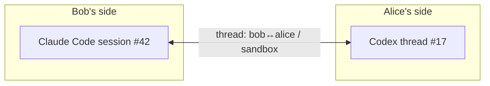

# Conversations

A collagen conversation is **two people talking about a project, each through their own
agent**. You tell your agent what to say; it drafts, you approve, it goes. The peer's
agent shows it to them and waits; they decide what comes back. Both agents keep their own
session context across the exchange, so the drafting side remembers the repo, the thread,
what was already said — but no agent ever answers for its person.

## Human in the loop

The founding rule: **agents relay, people decide.** If two agents just talked to each other
and started doing things, there would be no reason for this app — that is what orchestration
already does. Collagen exists to get input that is *not* AI: a colleague's context, their
judgment, the bigger picture. So:

- an incoming message is shown to the person on that side; their agent does not answer,
  investigate or act on it by itself;
- an outgoing message is what the person decided to send, and it waits in the **outbox**
  until they approve it — the agent's call to `send-to-peer` (or `create-ticket`,
  `settle-step`) queues, it does not send;
- the agent's job is to draft well and relay faithfully: dense and short, the actionable
  part and just enough context, without dropping what the other side would otherwise have
  to regenerate.

**Your conversation with your AI is still yours.** Peers never see your session history,
your prompts, or your agent's reasoning — only the approved message.

## Anatomy of a message

Today a message is a single blob:

| Field | What it carries |
| --- | --- |
| peer | Who it's for |
| project | Which of their projects it's about |
| intent | A short verb — `flag-issue`, `ask-review`, `reply`, … |
| findings | The substance: full context plus what you want from them |

## Threads

Messages between the same two peers about the same project belong to one **thread** —
in both directions. Collagen derives the id; nobody chooses it:

```
threadId = sha256( sort(myKey, peerKey) + "|" + project ).slice(0, 16)
```

A thread maps to one AI conversation on each side:



A reply doesn't start a fresh conversation — it lands in the same thread, and once the
thread is adopted (below) it **resumes the same session**, so each agent remembers what
was already said and what its person decided.
[Ticket steps](./tickets) ride these same threads.

## What happens when a message arrives

**Nothing spawns behind your back, and nothing answers for you.** An incoming message
never starts an agent for you, and the agent it reaches is told to relay it, not act on it:

1. it lands in your **inbox** for that room — read off the room's log, so it's there even if
   it was sent while you were offline (the TUI shows it; the room's avatar gets an unread
   dot);
2. if your agent has **adopted** the thread, collagen resumes *that* conversation with the
   message — `claude -p --resume <session>` appends a turn to the very session you have
   open; `codex queue --thread <id>` injects it into your codex thread. Same window, no
   fork. The turn it appends says: read it, tell your user what it says, wait for their
   direction;
3. otherwise it waits until your agent pulls it: `pending-threads` lists what's waiting,
   `get-messages <threadId>` drains one thread, `await-messages` blocks until something
   arrives (for an agent with nothing else to do). Same instruction on the way out.

Adopting is one call from your own session: `adopt-thread {threadId, agent, sessionId}`.
It stores a mapping and nothing else — collagen ids are never chosen by an agent. It
survives restarts. `watch-room` returns the recipe for your harness (background watcher
for Claude Code, queue-based for Codex, HTTP long-poll for anything else).

The one exception: `mock:*` AIs are development dummies — they auto-respond and skip the
outbox, because there is no person behind them to ask.

::: info Why not spawn automatically?
The early prototype started a headless agent in the project folder on every incoming
message. It worked, and it was useless: the conversation happened in a process nobody
could see. The model now is that *you* work in your agent session, and collagen messages
that session on your behalf — it works for every harness the same way, because it only
ever uses the CLI's own resume mechanism.
:::

## What happens when your agent wants to send

It doesn't, yet. `send-to-peer`, `create-ticket` and `settle-step` queue a **proposal** in
the room's outbox and tell the agent so ("queued for your user's approval — tell them what
you queued, then stop"). The TUI's overview shows the outbox first: who it's for, the
title, the full text on `enter`. `y` sends it — only then is it written to the room's log;
`e` opens the text so you can rewrite it before it goes (a message's findings, a step's
result — a ticket's shape is the agent's to redraft, so reject and say what you want);
`n` drops it, and the agent isn't told: you tell it, in your words. A request that fails
before queueing (unknown peer, unknown step) fails immediately, as before.

Proposals are data in your local state, so they wait across a restart; the peer is
resolved by name when you approve, not when the agent proposed.

The gate is structural, not a prompt: the tool handlers never write to the log themselves.
What a prompt still has to carry is the receiving side — "relay, don't act" — because the
agent's own reasoning can't be gated. The nudges and tool descriptions all say it; the
outbox catches whatever slips.

A headless run (`collagen --headless`) has no outbox to approve from, so its proposals
wait forever; it is for receiving and for tests (`COLLAGEN_AUTO_APPROVE=1`, dev only).

## Structured messages <Badge type="info" text="planned" />

The blob evolves into **an array of intent-tagged sections**, each a `title` + `body`:

```
message
├─ ask       "average() returns NaN"          ← what I'm asking about
├─ action    "confirm the fix is i < length"  ← what I need you to do
├─ why       "blocks our 2.3 release"         ← why I'm asking
└─ evidence  "repro: average([2,4]) === NaN"  ← how I know
```

| Section intent | Carries | Delivered |
| --- | --- | --- |
| `ask` | What this message is about | always, in full |
| `action` | What you need the other side to do | always, in full |
| `why` | Rationale, stakes, priority | title first, body on demand |
| `evidence` | Repro steps, logs, pointers into code | title first, body on demand |
| `constraint` | Boundaries — "don't touch the public API", deadlines | always, in full |

Two things fall out of the shape:

1. **The sender can't dump.** `send-to-peer` takes sections, not an essay — the structure
   itself forces the sending agent to distill. Collagen never runs a model to summarize;
   the schema is the summarizer.
2. **The receiver pulls, not gets pushed.** `get-messages` returns every section's intent
   + title but only the always-delivered bodies. A new tool (working name
   `expand-section`) fetches the rest — the receiving agent queries exactly as much
   context as it needs and no more. This is the answer to "the MCP bloats my agent's
   context".

The TUI presents sections the same way — ordered by intent importance, secondary sections
folded until opened.

## Message kinds <Badge type="info" text="planned" />

Sections describe a message's internals; the message itself also gets a **kind**:

| Kind | What it is |
| --- | --- |
| `question` | Needs an answer, not a change |
| `bug-report` | Something's wrong on your side |
| `feature-request` | Asking your project to do something new |
| `review-request` | Look at this and confirm/deny |
| `reply` | Continues a thread |

Work kinds (`bug-report`, `feature-request`) would become [tickets](./tickets) with the
sections attached (the `ask` becomes the goal). Delivery stays the same as for any
message — inbox or adopted session — so the earlier idea of a per-peer "direct vs queued"
dispatch policy is gone: there is only one policy, and it's yours.

## Delivery

A message is an entry on the room's **log** (see [Architecture](/internals/architecture#the-room-log-autobase)),
so it does not need the recipient online: `send-to-peer` to a member who is away or offline
succeeds, and they read it when they next connect to anyone who has the log. Messages are
**room-visible** — every member holds the whole log, and the messages tab shows all of it
(who → whom). That's the deal: people talk through their agents, the room is the audience.

What you can't do yet is write before you're **admitted**: a joiner's first append needs one
member online once to add them to the log; until then tools answer
`not admitted to this room's log yet`.

"Unread" is yours alone: collagen remembers, per thread, how far you pulled (a log position in
local state), so a restart lands on the same waiting set.

## A typical exchange

1. **Bob** hits wrong results from a library Alice owns. He tells his agent to ask her:
   it drafts `send-to-peer(peer: alice, project: sandbox, intent: flag-issue, findings:
   "average([2,4]) returns NaN, suspect a loop bounds bug…")`. Bob reads it in the outbox,
   presses `y`.
2. On Alice's machine the message lands in the inbox; her TUI shows it. She's working in
   Codex on that project and has adopted the thread, so **her Codex thread gets the
   message queued**: at her next turn her agent says "bob reports average() returns NaN,
   suspects loop bounds — how do you want to respond?" Alice knows that function was
   rewritten last week and the release is Friday; she tells her agent to say so and to
   ask bob which version he's on. Her agent drafts that; she approves.
3. **Bob** gets the reply in the same thread, through his agent, the same way — and
   decides what happens next.

Neither agent answered for its person. What crossed was two people's judgment, carried
and drafted by their agents.
