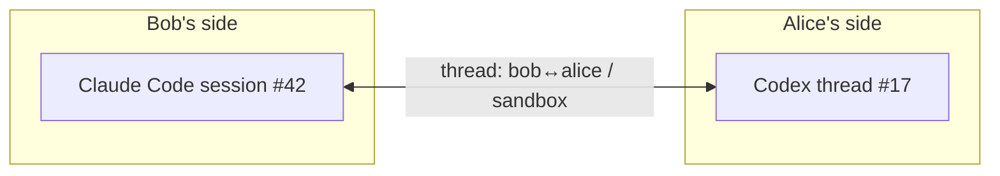

# Conversations

A collagen conversation is **two people talking about a project, each through their own
agent**. You tell your agent what to say; it says exactly that, and the outbox shows what went. The peer's
agent shows it to them and waits; they decide what comes back. Both agents keep their own
session context across the exchange, so the drafting side remembers the repo, the thread,
what was already said — but no agent ever answers for its person.

## Human in the loop

The founding rule: **agents relay, people decide.** If two agents just talked to each other
and started doing things, there would be no reason for this app — that is what orchestration
already does. Collagen exists to get input that is *not* AI: a colleague's context, their
judgment, the bigger picture. So:

- an incoming message reaches the person on that side as a **headline** — "bob asks you to
  address *ask-review* on *sandbox*" — nothing more. Their agent does not read the details,
  investigate, decide or answer by itself;
- when the person asks what it says, the agent reads it from collagen (`get-messages`, a
  ticket's steps with `get-tickets`) and relays what is there — never filling gaps from its
  own head. With that context, the person steers;
- when the person asks something the thread doesn't answer, the agent decides which it is:
  the person's own to answer, from this repo under their direction — or the other peer's,
  in which case it drafts the question for them (into the outbox, like any send);
- an outgoing message is what the person decided to send, so it goes when they say so and
  the **outbox** shows what went: the agent's call to `send-to-peer` (or `create-ticket`,
  `settle-step`) writes to the room's log there and then. Nothing is drafted for later
  approval, because the person already asked for it;
- the agent's job is to draft well and relay faithfully: dense and short, the actionable
  part and just enough context, without dropping what the other side would otherwise have
  to regenerate.

**Your conversation with your AI is still yours.** Peers never see your session history,
your prompts, or your agent's reasoning — only what you told your agent to send. The one
way any of it leaves is [transcripts on request](#transcripts-on-request) or an
[attachment](#attachments), and those are the one place a request from outside is *kept*
rather than acted on: a peer asks, your agent tells you who asked and for what, and it
hands the session over only when you say so.

## Anatomy of a message

Today a message is a single blob:

| Field | What it carries |
| --- | --- |
| peer | Who it's for |
| project | Which of their projects it's about |
| intent | A short verb — `flag-issue`, `ask-review`, `reply`, … |
| findings | The substance: full context plus what you want from them |
| ticketId | Optional — the message weighs in on that ticket (anyone may), and shows on its page |

## Threads

Messages between the same two peers about the same project belong to one **thread** —
in both directions. Collagen derives the id; nobody chooses it:

```
threadId = sha256( sort(myKey, peerKey) + "|" + project ).slice(0, 16)
```

A thread maps to one AI conversation on each side:



A reply doesn't start a fresh conversation — it lands in the same thread, and once the
thread is adopted (below) it **resumes the same session**, so each agent remembers what
was already said and what its person decided.
[Ticket steps](./tickets) ride these same threads.

## What happens when a message arrives

**Nothing spawns behind your back, and nothing answers for you.** An incoming message
never starts an agent for you, and the agent it reaches is told to relay it, not act on it:

1. it lands in your **inbox** for that room — read off the room's log, so it's there even if
   it was sent while you were offline (the TUI shows it; the room's avatar gets an unread
   dot);
2. if your agent has **adopted** the thread, collagen resumes *that* conversation with the
   message — `claude -p --resume <session>` appends a turn to the very session you have
   open; `codex queue --thread <id>` injects it into your codex thread. Same window, no
   fork. The turn it appends carries only the headline (who, project, intent) and says:
   tell your user that, wait, read the thread when they ask, never invent, and a question
   the thread can't answer is either theirs or the peer's;
3. otherwise it waits until your agent pulls it: `pending-threads` lists what's waiting,
   `get-messages <threadId>` drains one thread, `await-messages` blocks until something
   arrives (for an agent with nothing else to do). Same instruction on the way out.

Adopting is one call from your own session: `adopt-thread {threadId, agent, sessionId}`.
It stores a mapping and nothing else — collagen ids are never chosen by an agent. It
survives restarts. `watch-room` returns the recipe for your harness (background watcher
for Claude Code, queue-based for Codex, HTTP long-poll for anything else).

The one exception: `mock:*` AIs are development dummies — they answer by themselves,
because there is no person behind them to tell.

::: info Why not spawn automatically?
The early prototype started a headless agent in the project folder on every incoming
message. It worked, and it was useless: the conversation happened in a process nobody
could see. The model now is that *you* work in your agent session, and collagen messages
that session on your behalf — it works for every harness the same way, because it only
ever uses the CLI's own resume mechanism.
:::

## What happens when your agent sends

It sends. `send-to-peer`, `create-ticket`, `ask-review`, `post-review` and `settle-step`
write to the room's log as they are called, and the **outbox** tab is the receipt: every
send out of this machine, newest first, across every room you are in — kind, project, who
it went to, the subject, and the full text on `enter`. A send that can't work (unknown
peer, unknown step, not admitted yet) fails immediately and the agent is told why.

There is no draft-and-approve step, and that is deliberate: you asked your agent for the
message, so a queue asking you to approve your own request is a second yes for nothing —
and the TUI is not a text editor. What you change, you change by telling your agent, in
words, the way you asked for it in the first place.

The records are data in your local state, so the outbox survives a restart; the peer's
name is resolved as the send happens.

What the design still rests on is the *receiving* side — "relay, don't act" — because an
agent's own reasoning can't be gated by a tool boundary. The nudges and every tool
description say it, and the one thing a peer can ask of your machine that you did not ask
for, a [transcript](#transcripts-on-request), is kept until you say the word.

A headless run (`collagen --headless`) sends the same way; it is for receiving and for
tests.

## Transcripts on request

Debugging how the agents behaved around a ticket used to mean asking everyone to paste
their sessions. Instead: open the ticket (`enter` on it in the overview) and run `collect
transcripts` in its diagnostics row — or ask your agent for `request-transcripts` with a
ticket or thread id. Everyone present in the room is asked for
their agent's conversation on the threads involved. On each machine the ask is **kept, not
answered** — "alice asks for your codex conversation on thread … — nothing has left" — and
the session goes over only when that person tells their agent to (`share-transcripts`, or
`share-transcripts {decline: true}` to drop the ask and tell them nothing), and only
**from the moment they adopted the thread**: a session may hold unrelated work before
that, and that stays home. `list-transcripts` shows what is waiting, so the agent can read
the asks out instead of deciding for its person. Your own adopted conversations on those
threads are filed at once.

What comes back travels directly to you, never over the shared log, and is filed under
`~/.config/collagen/transcripts/<subject>/<peer>-<threadId>.<ai>.jsonl` — the session
file's own lines (Claude Code's `~/.claude/projects/…/<session>.jsonl`, Codex's
`~/.codex/sessions/…/rollout-…-<thread>.jsonl`), so any tool that reads those reads
these. Next to each file a `.meta.json` records the provenance — who (name and key), which
agent, the thread and session, the slice's start, how many entries, when it arrived, which
request — so a renamed peer or a stray folder is never a mystery. In the app, `transcripts`
on the ticket's diagnostics row opens the list (`from bob · codex · 61 entries · since … ·
received 5m ago`); `enter` opens one and shows its turns, one line each (`HH:MM:SS  who
first line`), `enter` unfolds a turn's text in full, `←`/`esc` step back to the list and
then to the ticket. For the agent, `list-transcripts` lists the same, with provenance.
Nothing here runs an agent CLI; the files are read as they are.

## Attachments

A ticket can carry **files**: a screenshot of the flicker, the PDF spec, a log, a
transcript you collected elsewhere — so the people in the room and their agents look at
the thing itself instead of guessing at it from a description. The pattern is the same
as everything else here: **the file stays on your machine**. What goes on the ticket is
a *reference* — name, size, type, who holds it, a note saying why, and for a transcript
its meta (whose conversation, which agent, how many entries, since when). Everyone sees
the reference on the ticket, online or not; the reference is on the room's log, so it is
there whether or not you are.

Attaching is a send like any other, and shows in your **outbox**: open the ticket,
`attach` in its diagnostics row (type a path, or mark a collected transcript, `enter`), or
ask your agent for `attach-files` with the paths. The references then appear on the ticket
for everyone — you named the files, so nothing else on your disk can be asked for.

Whoever wants a file **fetches** it: on the ticket page, `y` on the attachment row; for
an agent, `fetch-attachments` with the ticket id. The ask goes to the holder's collagen
directly, and if they are online the bytes come back — only for ids they attached, so
nothing else on their disk can ever be asked for. Fetched files land under
`~/.config/collagen/attachments/ticket-<id>/<attachment id>-<name>` with a `.meta.json`
beside them (the reference, plus when it arrived); a fetched transcript lands with the
other transcripts, under `ticket-<id>/`, its meta saying where it was first collected
and who handed it over. The ticket page shows `⇩ here` and the path once you have it;
`fetch-attachments` returns the path so the agent can read the file. If the holder is
offline the reference still stands — fetch when they are back.

## Structured messages <Badge type="info" text="planned" />

The blob evolves into **an array of intent-tagged sections**, each a `title` + `body`:

```
message
├─ ask       "average() returns NaN"          ← what I'm asking about
├─ action    "confirm the fix is i < length"  ← what I need you to do
├─ why       "blocks our 2.3 release"         ← why I'm asking
└─ evidence  "repro: average([2,4]) === NaN"  ← how I know
```

| Section intent | Carries | Delivered |
| --- | --- | --- |
| `ask` | What this message is about | always, in full |
| `action` | What you need the other side to do | always, in full |
| `why` | Rationale, stakes, priority | title first, body on demand |
| `evidence` | Repro steps, logs, pointers into code | title first, body on demand |
| `constraint` | Boundaries — "don't touch the public API", deadlines | always, in full |

Two things fall out of the shape:

1. **The sender can't dump.** `send-to-peer` takes sections, not an essay — the structure
   itself forces the sending agent to distill. Collagen never runs a model to summarize;
   the schema is the summarizer.
2. **The receiver pulls, not gets pushed.** `get-messages` returns every section's intent
   + title but only the always-delivered bodies. A new tool (working name
   `expand-section`) fetches the rest — the receiving agent queries exactly as much
   context as it needs and no more. This is the answer to "the MCP bloats my agent's
   context".

The TUI presents sections the same way — ordered by intent importance, secondary sections
folded until opened.

## Message kinds <Badge type="info" text="planned" />

Sections describe a message's internals; the message itself also gets a **kind**:

| Kind | What it is |
| --- | --- |
| `question` | Needs an answer, not a change |
| `bug-report` | Something's wrong on your side |
| `feature-request` | Asking your project to do something new |
| `review-request` | Look at this and confirm/deny |
| `reply` | Continues a thread |

Work kinds (`bug-report`, `feature-request`) would become [tickets](./tickets) with the
sections attached (the `ask` becomes the goal). Delivery stays the same as for any
message — inbox or adopted session — so the earlier idea of a per-peer "direct vs queued"
dispatch policy is gone: there is only one policy, and it's yours.

## Solo player <Badge type="info" text="planned" />

Collagen is built for two people, but the same machinery is useful with **one person and
two agents** — Claude Code writes the change and asks for a review, Codex reads it with
the [why](./tickets) attached and says what it thinks. Nothing stops you filing that
review today: `ask-review` with no `peers` puts the ticket in the room for whoever picks
it up, and your second agent can read it and `post-review` on a step of its own.

What is missing is the nudge. Today a delivery is **peer-shaped**: a step becoming
actionable, or a review's why being revised, reaches the *other members* of the room, and
a change your own identity authored is skipped on purpose — you should not be told what
you just did. Two agents on one machine are one identity, so the second one never hears:
it has to be told by you, or go looking.

The idea is to make the unit of delivery **an agent attached to a peer**, not the peer.
Collagen already knows them: `adopt-thread` stores an `{ai, sessionId}` per thread, and
resuming those sessions is the whole delivery mechanism. So:

- your agents are the adopted sessions on this machine, and a nudge goes to **every one of
  them except the one whose action caused it** — Claude asks for the review, so Claude is
  not told; Codex has attached itself, so Codex is;
- the message is the same headline a peer would get, and carries the same instruction:
  relay it to the person, read the ticket when they ask, never review on your own
  initiative. The human stays in the loop — this is not two agents talking, it is one
  person with a second reader;
- everything else already works, because the ticket, its steps and its why are on the
  room's log whether the reader is across the network or in another terminal on your desk.

Open questions, and they are the reason this is not built yet:

| Question | Why it is not obvious |
| --- | --- |
| Which agent caused it? | A tool call does not say which session it came from. Something has to identify the caller — the MCP client, or an explicit session on the call — or the nudge loops back to its author. |
| Which sessions count? | Every adopted thread on the machine, or only those on the ticket's own threads? The first is noisy, the second means a fresh agent hears nothing until it adopts. |
| How does it read? | One person, two agents, one outbox and one trace: the lists would have to say which of your own agents did a thing, which no screen does today. |
| Is a step ever "theirs"? | Ownership is a person, deliberately (`TicketStep.owner` is a pubkey). A second agent reviewing your change posts on a step of *yours*, which is fine for a review and wrong for a task. |

## Delivery

A message is an entry on the room's **log** (see [Architecture](/internals/architecture#the-room-log-autobase)),
so it does not need the recipient online: `send-to-peer` to a member who is away or offline
succeeds, and they read it when they next connect to anyone who has the log. Messages are
**room-visible** — every member holds the whole log, and the messages tab shows all of it
(who → whom). That's the deal: people talk through their agents, the room is the audience.

What you can't do yet is write before you're **admitted**: a joiner's first append needs one
member online once to add them to the log; until then tools answer
`not admitted to this room's log yet`.

"Unread" is yours alone: collagen remembers, per thread, how far you pulled (a log position in
local state), so a restart lands on the same waiting set.

## A typical exchange

1. **Bob** hits wrong results from a library Alice owns. He tells his agent to ask her:
   it calls `send-to-peer(peer: alice, project: sandbox, intent: flag-issue, findings:
   "average([2,4]) returns NaN, suspect a loop bounds bug…")`, and the outbox shows what
   went.
2. On Alice's machine the message lands in the inbox; her TUI shows it. She's working in
   Codex on that project and has adopted the thread, so **her Codex thread gets the
   message queued**: at her next turn her agent says "bob reports average() returns NaN,
   suspects loop bounds — how do you want to respond?" Alice knows that function was
   rewritten last week and the release is Friday; she tells her agent to say so and to
   ask bob which version he's on. Her agent sends exactly that.
3. **Bob** gets the reply in the same thread, through his agent, the same way — and
   decides what happens next.

Neither agent answered for its person. What crossed was two people's judgment, carried
and drafted by their agents.
