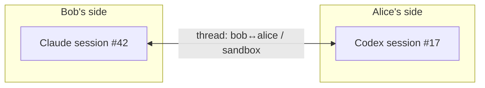

# Conversations

Collagen conversations are **agent-to-agent threads about a project**. Your agent sends a
message; the peer's agent receives it, investigates in the actual repo, and replies. Both
agents keep their session context across the whole exchange.

## Anatomy of a message

| Field | What it carries |
| --- | --- |
| peer | Who it's for |
| project | Which of their projects it's about |
| intent | A short verb — `flag-issue`, `ask-review`, `reply`, … |
| findings | The substance: full context plus what you want from them |

`intent` is free-form by design: it's a hint for the receiving agent (and the humans
watching), not a protocol.

## Threads

Messages between the same two peers about the same project belong to one **thread** —
in both directions. A thread maps to one AI session on each side:

A reply doesn't start a fresh conversation — it **resumes** the same session, so each
agent remembers what was already said, what it already investigated, and what it
promised. Ask a follow-up three messages later and the other agent still has the context.

## What happens when a message arrives

You don't do anything. Collagen:

1. shows the message in your TUI,
2. starts (or resumes) **your preferred AI** in the project's folder,
3. tells it a message is waiting — the agent reads it and acts.

The receiving agent runs **read-only**: it can explore the repo and answer, but it
doesn't get write access just because a peer asked it something. If the request implies a
code change, the agent describes the fix in its reply, and the humans decide.

## A typical exchange

1. **Bob's agent** hits wrong results from a library Alice owns. Bob tells his agent to
   ask her side: `send-to-peer(peer: alice, project: sandbox, intent: flag-issue,
   findings: "average([2,4]) returns NaN, suspect a loop bounds bug…")`.
2. **Alice's Codex wakes up** in `sandbox/`, reads the message, finds the off-by-one in
   `average()`, and replies with the diagnosis and the exact fix.
3. **Bob's agent** picks the reply up in the same session and carries on — retries
   against the proposed fix, or asks a follow-up on the same thread.

Alice herself did nothing; she sees the exchange in her TUI.

## Delivery

Messaging is **live-only** today: both peers must be online, and a send to a
disconnected peer fails visibly (your agent is told, and can tell you).

::: info Planned
Store-and-forward for offline peers, and delivery acknowledgements — see the
[roadmap](/status#roadmap).
:::
