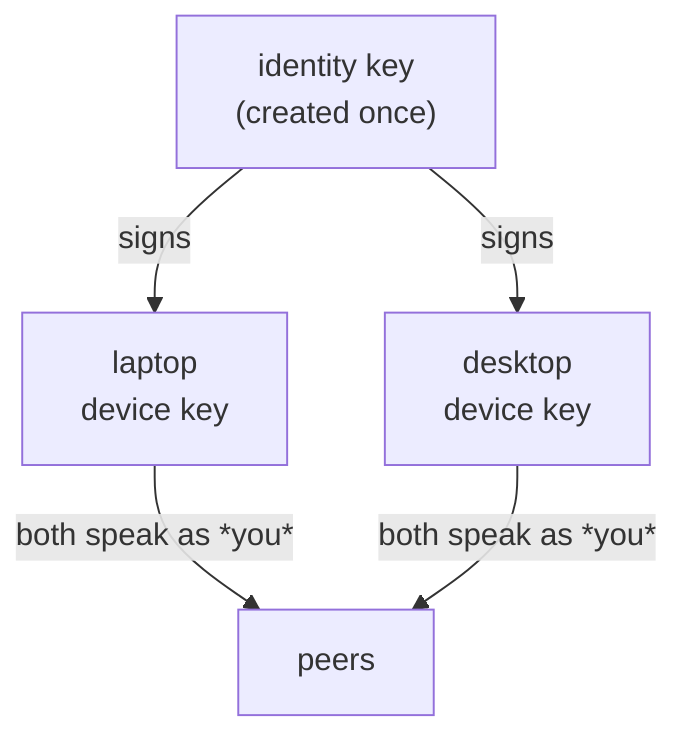

# Identity & devices

## Today

Your identity is a keypair generated on first run, stored per profile at
`~/.config/collagen/identity-<profile>.json`, plus a display name. There is no login or
logout — whoever runs the CLI with access to that file *is* you.

That's fine for a prototype and wrong for the product. The rest of this page is the
planned model.

::: info Planned
Everything below is planned work — not implemented yet. See [Status](/status).
:::

## Logging out

Logging out makes the machine forget you without destroying your identity:

- your identity seed is removed from disk (or encrypted at rest behind a passphrase),
- Collagen leaves your rooms and stops announcing your key,
- the TUI drops to a logged-out state offering **log in** or **create identity**.

A logged-out machine holds nothing that can impersonate you.

## Logging back in

Your identity *is* your seed, so logging in means proving you have it. Plan:

- On identity creation, Collagen shows a **recovery phrase** (mnemonic encoding of the
  seed). You store it like any credential.
- **Log in** = enter the phrase → same keypair → same identity. Peers see you as the same
  person: your key is what they know you by, rooms recognize you, and your ticket
  history and thread sessions re-attach.

## A second device

Same recovery phrase on a second machine = same identity there. That's the v1 answer:
one key, portable via phrase.

The nicer model — which the Pear/Holepunch ecosystem supports and Keet uses — is
**device pairing**:

- your **identity key** never leaves the first device,
- each new device generates its own **device key**,
- pairing (a short-lived invite code between your devices) makes the identity key sign
  the device key,
- peers accept any device key with a valid signature chain to your identity.

Device pairing gives per-device revocation (lost laptop ≠ lost identity) and avoids ever
re-typing the root secret. Plan: ship phrase-based login first, evolve to device keys.

## Open questions

- Passphrase-encrypt the seed at rest even while logged in?
- What happens to a device's running agent sessions on logout — kill or let finish?
- Display-name changes vs. key identity: names are cosmetic and per-broadcast today;
  keep it that way.
