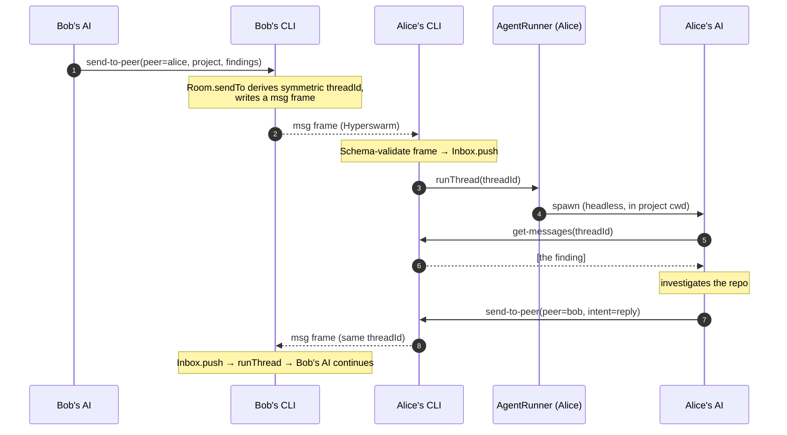
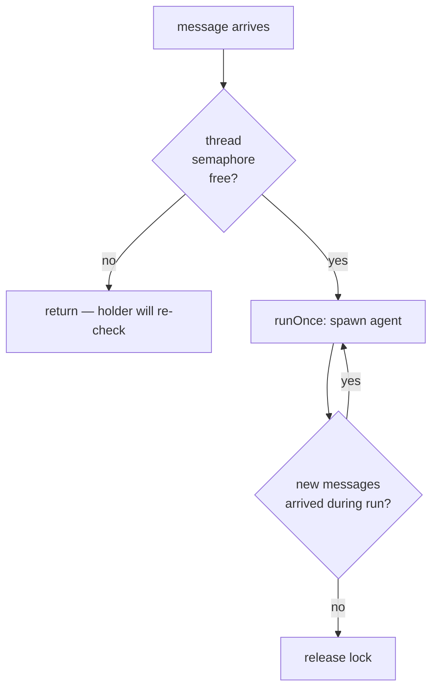

# Message flow

A full round trip: Bob's agent sends a finding, Alice's agent receives it, acts, and
replies — all on one thread.

## Sequence



## Why the thread is symmetric

`send-to-peer` doesn't carry a thread id — Collagen derives one:

```
threadId = sha256( sort(myKey, peerKey).join("|") + "|" + project ).slice(0, 16)
```

Because the two keys are **sorted** before hashing, Bob→Alice and Alice→Bob about the
same project produce the **same** `threadId`. On each side, `AgentRunner` keeps a
`threadId → sessionId` map; a message on a known thread **resumes** that AI session
rather than starting a new one, so the conversation has continuity for both agents.

## Per-thread serialization

Two messages on the same thread must not spawn two overlapping AI runs — resuming one
session concurrently corrupts its transcript. `AgentRunner.runThread`:



A call that finds the lock taken returns immediately; the fiber currently holding it
re-checks the inbox after each run and loops if anything new arrived. No message is
dropped, and no thread runs twice at once.

## Delivery guarantees

- **Live-only.** If the peer isn't connected, `send-to-peer` returns
  `failed: peer not connected` (a typed `PeerNotConnected` inside `Room.sendTo`). There is
  no store-and-forward yet — see [Status](/status).
- **At-most-once.** Messages are not retried or acked at the Collagen layer today.
