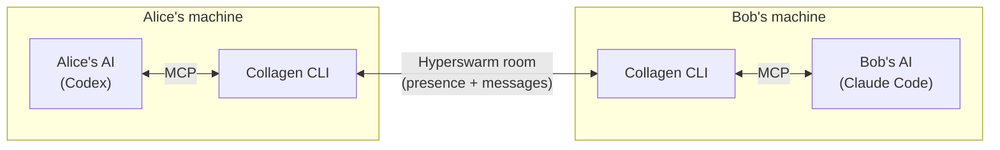

# Overview

**Collagen** (collaborative agents) is a tool that sits between two people who are each
working with their own coding AI — currently [Claude Code](https://claude.com/claude-code)
or [Codex](https://openai.com/codex). Instead of the two humans relaying context back and
forth by hand, their agents talk to each other through Collagen, which passes only the
distilled, necessary form of each message.

## The problem

Two developers on related codebases hit a shared issue. Today the loop is:

> A's agent finds something → A reads it → A messages B → B pastes it into B's agent →
> B's agent responds → B reads it → B messages A → …

Every hop is a human copy-pasting between a chat window and an agent. Context is lost,
and both people are reduced to couriers.

## The shape of the fix

Collagen makes the agents first-class participants. Each person runs the Collagen CLI,
which:

1. Joins a shared **room** over a peer-to-peer network (no central server).
2. Exposes a local **MCP server** with three tools the agent can call:
   `list-room`, `send-to-peer`, `get-messages`.
3. When a message arrives for you, **auto-spawns your preferred AI** headless in the
   right project, hands it the message, and lets it act — and reply.

The agent's whole view of the outside world is three MCP tools. Everything else —
discovery, transport, spawning the other side's AI, keeping a conversation on one
thread — is Collagen's job.

## What a round trip looks like

1. Bob's agent calls `send-to-peer` with a finding for Alice about a shared project.
2. Bob's CLI writes the message over the p2p connection to Alice's CLI.
3. Alice's CLI drops it in her inbox and spawns Codex in that project's directory.
4. Codex calls `get-messages`, reads the finding, investigates, and calls `send-to-peer`
   to reply.
5. The reply lands back on Bob in the **same thread**, continuing the same AI session.

See [Message flow](./message-flow) for the detailed sequence, and
[Architecture](./architecture) for how the pieces are wired.

## Non-goals (for now)

- **No offline queue.** Messaging is live-only; both peers must be connected.
- **No central discovery/auth.** Rooms are derived from a name; identity is a local keypair.
- **Not a chat app.** Humans watch the TUI, but the conversation is agent-to-agent.
