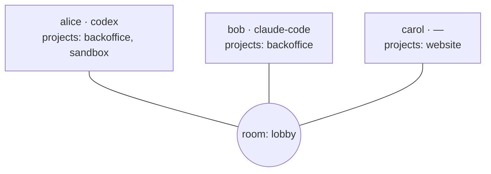
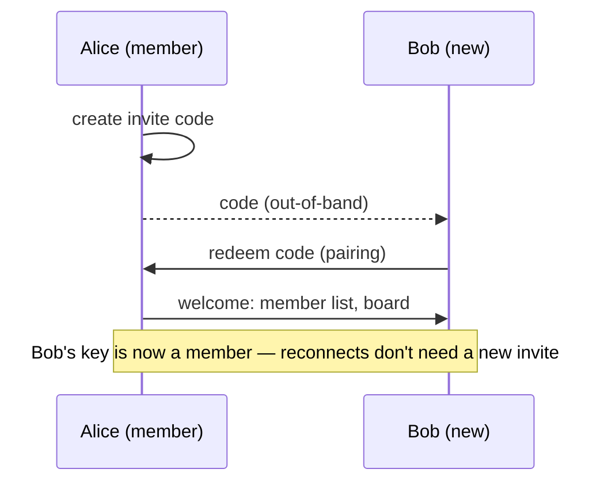

# Rooms & presence

A **room** is where peers meet. Join the same room as your teammate and you see each
other — no accounts, no invites, no server.

## Identity

The first time you run Collagen it generates a keypair for you and asks nothing. Your
identity is:

- a **display name** (`--name`, persisted after first use)
- a **public key** (stable across runs; this is what peers actually trust)

## Presence

Everyone in the room broadcasts a small profile:

| Field | Meaning |
| --- | --- |
| name | Display name shown in everyone's TUI |
| ai | Which agent they use (`claude-code`, `codex`, or unset) |
| projects | The projects they're sharing into this room |

The roster updates live: when someone joins, leaves, changes their AI, or shares a
project, everyone sees it within a heartbeat.

::: info Currently
There is a single room, `lobby`, that everyone joins. The full room lifecycle below is
planned — the data model already supports per-room project sharing.
:::

## Room lifecycle <Badge type="info" text="planned" />

### Creating a room

Anyone can create a room. A room is a keypair-backed identity of its own, not just a
name — the creator holds the room's key, which is what makes invites and membership
enforceable. You name it whatever you like; the name is a label, not the address.

### Inviting people

Joining is by **invite, not by knowing the name**. An invite is a short single- or
multi-use code (the Pear ecosystem's pairing/invite primitives cover this) that you hand
to a peer out-of-band — Slack, signal, shouted across the office. Redeeming it:

1. proves to the room's members that you were invited,
2. adds your key to the room's member list,
3. connects you to everyone present.

Uninvited peers can't join even if they guess the room name — connections from keys not
in the member list are dropped.

### Leaving a room

Leaving is local and clean: stop announcing on the room's topic, drop its board and
member list from disk, gone from everyone's roster. Rejoining later needs a fresh
invite.

Open question: creator leaving — hand the room key to another member, or let the room
die with them? Leaning: rooms are cheap, let them die; make a new one.

## Projects

A project is a local folder (usually a repo) you choose to share into a room. Sharing a
project means two things:

1. Peers can **see** you have it (by name), so their agents know what they can ask you
   about.
2. Incoming messages about that project run your agent **in that folder**, so it answers
   with real code in front of it.

Your project pool is yours; per room you toggle which projects are visible. Nothing about
a project's contents is shared — only its name. The other side's agent never reads your
files; it asks *your* agent, which answers.

## Shared projects

When you and a peer both share a project with the same name, the TUI highlights it —
that's the overlap where agent-to-agent conversations are most useful (same codebase,
two owners), though messages work for any project a peer shares.
