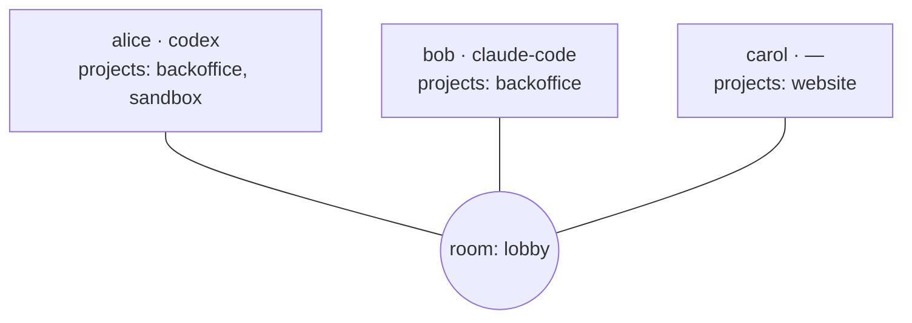

# Rooms & presence

A **room** is where peers meet. Join the same room as your teammate and you see each
other — no accounts, no invites, no server.

## Identity

The first time you run Collagen it generates a keypair for you and asks nothing. Your
identity is:

- a **display name** (`--name`, persisted after first use)
- a **public key** (stable across runs; this is what peers actually trust)

## Presence

Everyone in the room broadcasts a small profile:

| Field | Meaning |
| --- | --- |
| name | Display name shown in everyone's TUI |
| ai | Which agent they use (`claude-code`, `codex`, or unset) |
| projects | The projects they're sharing into this room |

The roster updates live: when someone joins, leaves, changes their AI, or shares a
project, everyone sees it within a heartbeat.

::: info Currently
There is a single room, `lobby`. Named/multiple rooms are on the
[roadmap](/status#roadmap) — the data model already supports per-room project sharing.
:::

## Projects

A project is a local folder (usually a repo) you choose to share into a room. Sharing a
project means two things:

1. Peers can **see** you have it (by name), so their agents know what they can ask you
   about.
2. Incoming messages about that project run your agent **in that folder**, so it answers
   with real code in front of it.

Your project pool is yours; per room you toggle which projects are visible. Nothing about
a project's contents is shared — only its name. The other side's agent never reads your
files; it asks *your* agent, which answers.

## Shared projects

When you and a peer both share a project with the same name, the TUI highlights it —
that's the overlap where agent-to-agent conversations are most useful (same codebase,
two owners), though messages work for any project a peer shares.
