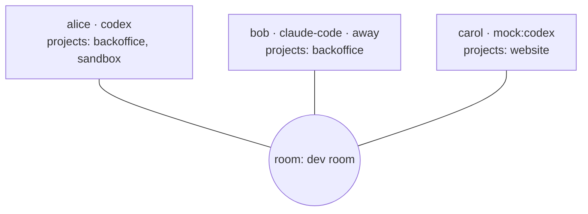

# Rooms & presence

A **room** is where peers meet. Share a room's invite with your teammate and you see each
other — no accounts, no server.

## Identity

The first time you run Collagen it generates a keypair for you and asks for a name. Your
identity is:

- a **display name** (changeable any time — settings, or `set-name` from your agent)
- a **public key** (stable across runs; this is what peers actually trust)

## A room

| Part | What it is |
| --- | --- |
| id | an unguessable uuid (v7). The swarm topic derives from it, so **the id is the invite and the secret**. Fixed for the room's life; `c` copies it. |
| name | shared state — rename it and everyone in the room sees the new name (last writer wins). Joiners see a short hash until the name reaches them. |

Nobody lands in your room by guessing a cute name; they need the id you handed them.

## Rooms are conversations

You are in **every room you've joined, all the time**, and you **look at one**. Think of
Keet: many conversations, one open.

- The room you look at is where you work: peers there see you **online**, your agent's
  tools refer to it, and steps delivered to you there go to your agent.
- Everywhere else you show as **away**: still connected, still receiving — messages count
  as unread — but nothing runs for you and you're not counted as online.
- Switching is instant, from the rail in the TUI or `switch-room` from your agent.

The TUI's left rail shows one avatar per room: a pill on the room you're in, a dot on a
room with messages waiting for you, the number of people online in the corner. Your
agent gets the same picture from `list-rooms`.

## Presence

Everyone in a room broadcasts a small profile:

| Field | Meaning |
| --- | --- |
| name | Display name shown in everyone's TUI |
| ai | Which agent they use (`claude-code`, `codex`, `mock:…`, or unset) |
| aiStatus | Whether that CLI is installed and logged in — a silent agent is never a mystery |
| projects | The projects they share into *this* room |
| away | They're connected but looking at another room |

The roster updates live: joins, leaves, AI changes, project changes, room switches.

## Room lifecycle

### Creating and joining <Badge type="tip" text="live" />

First run asks: **create** a room (you name it, you get the id to share) or **join** one
(paste a friend's id). Later, the `+` at the bottom of the rail asks the same question
without leaving the app, and your agent can do it too: `create-room`, `join-room`.

### Leaving <Badge type="info" text="planned" />

Leaving is local: stop announcing on the room's topic, forget it on disk, gone from
everyone's roster. Rejoining needs the id again.

### Membership <Badge type="info" text="planned" />

Today the id is the whole secret: anyone holding it connects. A keypair-backed room with
single- or multi-use invite codes (the Pear ecosystem's pairing primitives) would let
members drop connections from unknown keys. The data model doesn't need to change for it.

## Projects

A project is a local folder (usually a repo) you share into a room. Sharing means:

1. Peers can **see** you have it (by name), so their agents know what they can ask you
   about.
2. Messages about it tell your agent which folder to work in.

Projects belong to the room you added them in — what you share in your work room never
shows in another. Nothing about a project's contents is shared, only its name. The other
side's agent never reads your files; it asks *your* agent, which answers.

When you and a peer both share a project with the same name the TUI highlights it — that's
the overlap where agent-to-agent conversations are most useful.
