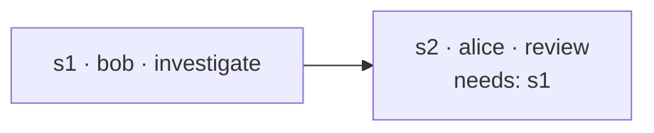

# Tickets

A ticket is how multi-step work between peers is tracked instead of living only in chat
threads that scroll away. It is a **shared record**: one goal, a list of steps, each with
an owner, a dependency list, a status and — once done — a result. Every peer in the room
holds a merged copy, and the TUI shows it in the room's overview.

Tickets are **data, not commands**. Settling a step is a choice the owning peer's agent
makes; a record can't force anyone's machine to do anything.

## A ticket

| Field | Notes |
| --- | --- |
| id | uuid, room-unique |
| project | which shared project it concerns |
| goal | the ask, one line |
| createdBy | peer key — authoritative for the ticket's structure |
| steps | see below |

A **step**:

| Field | Notes |
| --- | --- |
| id | `s1`, `s2`, … (or chosen) |
| owner | the peer expected to settle it — a peer or yourself |
| intent | short verb, like a message's (`investigate`, `review`, …) |
| description | what is being asked, in full |
| needs | step ids that must settle first |
| status | `pending` → `suspended` (delivered to the owner) → `settled` / `failed` |
| result | the owner's findings, or the failure reason |



## How a step gets done

1. A step is **actionable** when its owner hasn't settled it and everything in `needs`
   has settled.
2. Collagen marks it `suspended` (so nothing re-triggers it) and delivers it to the owner
   as a message — on the **same thread a plain message would use** between the ticket's
   creator and that owner about that project. The message carries the step, the
   settled inputs it depends on, and the exact `settle-step` call to make.
3. What happens next follows the [messaging policy](./conversations#what-happens-when-a-message-arrives):
   if the owner's agent has adopted that thread, their conversation resumes with the
   step in it; otherwise it waits in their inbox until they pull it. Nothing is spawned
   for them.
4. The owner's agent calls `settle-step` with its findings. The merged ticket is broadcast;
   steps waiting on this one become actionable on *their* owners' side.

Because a ticket has no thread of its own, "the discussion about this work" and "the
status of this work" travel together: the ticket in the overview, its exchange in the
messages tab, both about the same thread.

### A review gate

There is no separate `review` status. Want the requester to confirm before the work counts
as done? Make the confirmation a step:

```
s1  owner: bob    investigate  "what does average() do"
s2  owner: alice  review       "check bob's answer"   needs: s1
```

Bob's settled result becomes the input to alice's review step, which is delivered to alice
on her thread with bob — the same conversation where she would have asked in the first
place.

## Agents drive tickets

| Tool | Purpose |
| --- | --- |
| `create-ticket` | goal, project, steps (owner by peer name, intent, description, `needs`) |
| `settle-step` | settle or fail a step you own, with your result |
| `get-tickets` | every ticket in the room you're looking at, merged, with owners resolved to names |

Prefer a ticket over a chain of `send-to-peer` when the work has more than one step or
more than one owner — the intermediate state stays inspectable by everyone, and the
dependency order is enforced by delivery, not by remembering.

## In the TUI

The overview tab lists the room's tickets: goal, project, `settled/total`, and a glyph per
step (`·` pending, `⟳` suspended, `✓` settled, `✗` failed). `enter` unfolds the steps
with owner, status and result.

## Sync model

Tickets are shared state. Every change broadcasts the whole ticket; each peer merges it
with what it has using rules that converge regardless of arrival order:

- steps are unioned by id — the creator adds structure, owners never lose steps
- per step, the higher status wins (`settled`/`failed` beat `suspended` beat `pending`);
  equal ranks resolve by timestamp, then a deterministic tiebreak
- the goal follows the newest timestamp

A peer that joins later receives every ticket from the peers already present.

::: warning In memory today
Tickets live in memory. As long as one peer who knows a ticket stays up, the others get it
back on reconnect; if everyone restarts, it is gone. Persisting each room's tickets to disk
and merging them on reconnect is next on the [roadmap](/status#roadmap) — the merge rules
above already make that safe.
:::

## What changed from the original plan

The first spec was a mini-Jira: columns `todo / doing / review / done / blocked /
wont-do`, an assignee, a status history. It was replaced by the step model above before
any of it shipped: agents need dependencies and results more than columns, several peers
can own parts of one ticket, and a review gate is just a step. Human-facing board views
can still be derived from the steps if they turn out to be wanted.
