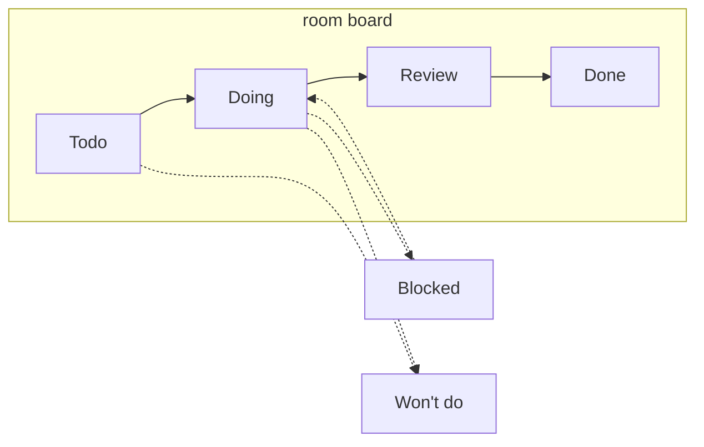

# Tickets

::: info Partially implemented
The ticket **data layer** is live: tickets are CallScript-inspired inert records —
goal, steps with owners and dependencies, per-step status and settled results — gossiped
to the room, merged deterministically on every peer, and synced to late joiners. Agents
drive them over MCP (`create-ticket`, `settle-step`, `get-tickets`); when a step you own
becomes actionable (its dependencies settled), your agent is triggered automatically
with the settled inputs, and its `settle-step` wakes the next owner in the chain.
The TUI board below is still planned — see [Status](/status).
:::

The TUI grows a lightweight ticket board — a mini-Jira scoped to a room. Tickets are how
work between peers (and their agents) gets tracked instead of living only inside chat
threads that scroll away.

## The board

Each room has one board, visible to every member. The TUI renders it as columns by
status; tickets are created, moved, and closed either by humans (keyboard) or by agents
(MCP tools).

## Statuses

| Status | Meaning |
| --- | --- |
| `todo` | Accepted, not started |
| `doing` | Someone (or someone's agent) is on it |
| `review` | Work done, awaiting a human or the requesting peer's confirmation |
| `done` | Confirmed complete |
| `blocked` | Can't proceed — waiting on something outside the ticket |
| `wont-do` | Deliberately closed without doing it |

Six is the intended ceiling — if a workflow needs more, it probably needs a second
ticket, not a seventh column.

## A ticket

| Field | Notes |
| --- | --- |
| id | stable, room-unique |
| title / description | the ask |
| project | which shared project it concerns |
| status | see above |
| assignee | a peer (their agent does the work) |
| created by | peer key |
| thread | the agent conversation attached to this ticket |
| history | status changes with who/when — humans and agents both leave a trail |

**Ticket ↔ thread linkage** is the interesting part: a ticket can spawn an agent
conversation (its `thread`), so "the discussion about this work" and "the status of this
work" are one object. Opening a ticket in the TUI shows the exchange underneath — the
distilled collagen messages, never either side's private AI transcript
(see [Context, not transcripts](./conversations#context-not-transcripts)).

## Agents close their own tickets

Agents get ticket tools on the MCP server alongside the messaging tools:

| Tool | Purpose |
| --- | --- |
| `list-tickets` | Board state for a room (filter by status/assignee/project) |
| `create-ticket` | File work — e.g. the peer's agent found a bug on your side |
| `update-ticket` | Change status, reassign, append a comment |

The flow the board is designed around: a ticket is assigned to you, **your agent picks
it up** (ticket → `doing`), works in the project, and when it believes the work is
complete it calls `update-ticket` to move it forward.

**Guardrail:** by default an agent can move a ticket to `review`, not `done` — `done` is
a human (or requesting peer) confirmation. Configurable per room for people who want
fully autonomous closes. `wont-do` from an agent always requires a stated reason, which
lands in the history.

## Tickets from messages

Work-kind [messages](./conversations#message-kinds) (`feature-request`, `bug-report`)
land as tickets with the message's sections attached (the `ask` becomes the title, the
rest is the description). Every ticket **starts or continues a conversation** — that's
the point of the board; the ticket's thread is where the work happens.

What you control is **dispatch** — when that conversation runs:

- **direct**: your agent spawns on arrival, the ticket opens in `doing` with the thread
  already live.
- **queued**: the ticket waits in `todo`; the thread kicks off on pickup — you move it
  to `doing`, or your agent pulls the next queued ticket.

Dispatch is your policy (per room or per peer): e.g. bug reports direct, feature
requests queued. Senders can hint urgency; your policy wins.

Triage on queued tickets is the usual moves: assign and pick up, or close `wont-do` with
a reason — which flows back to the requesting peer on the ticket's thread. Their agent
checks progress with `list-tickets` instead of asking "is it done yet" in chat.

## Sync model

The board is shared state, which is new — presence and messages today are ephemeral.
Tickets must survive restarts and reach peers who were offline when a change happened.

Plan: per-room replicated log of ticket operations (create / status change / comment),
merged deterministically on reconnect — the Pear stack has the primitives for this
(append-only cores / Autobase). Conflicts resolve last-writer-wins per field, with
history keeping both entries so nothing is silently lost.

This is the same machinery offline messaging needs, so the two land together — see
[Status](/status#roadmap).
