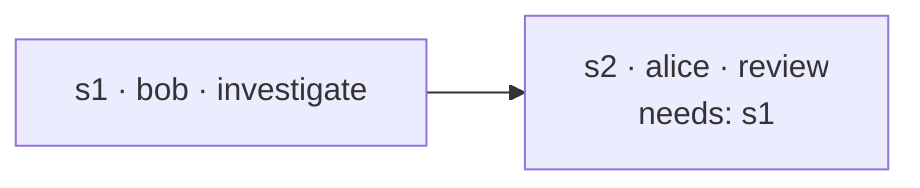

# Tickets

A ticket is how multi-step work between peers is tracked instead of living only in chat
threads that scroll away. It is a **shared record**: one goal, a list of steps, each with
an owner, a dependency list, a status and — once done — a result. Every peer in the room
holds a merged copy, and the TUI shows it in the room's overview.

Tickets are **data, not commands**. Whether and how a step gets done is the owning
person's choice — their agent shows them the step and waits; settling it is their say,
and it happens because they said so. A record can't force anyone's machine to do
anything.

## A ticket

| Field | Notes |
| --- | --- |
| id | uuid, room-unique |
| project | which shared project it concerns |
| goal | the ask, one line |
| createdBy | peer key — authoritative for the ticket's structure |
| kind | `task` (the plain one) or `review` — see [review tickets](#review-tickets-the-why-travels-with-the-code) |
| steps | see below |

A **step**:

| Field | Notes |
| --- | --- |
| id | `s1`, `s2`, … (or chosen) |
| owner | the peer expected to settle it — a peer, or yourself. Always a person: a step nobody is doing does not exist |
| intent | short verb, like a message's (`investigate`, `review`, …) |
| description | what is being asked, in full |
| needs | step ids that must settle first |
| status | `pending` → `suspended` (delivered to the owner) → `settled` / `failed` |
| result | the owner's findings, or the failure reason |



## How a step gets done

1. A step is **actionable** when its owner hasn't settled it and everything in `needs`
   has settled.
2. Collagen marks it `suspended` (so nothing re-triggers it) and delivers it to the owner
   as a message — on the **same thread a plain message would use** between the ticket's
   creator and that owner about that project. The message carries the step, the
   settled inputs it depends on, and the exact `settle-step` call to make.
3. What happens next follows the [messaging policy](./conversations#what-happens-when-a-message-arrives):
   if the owner's agent has adopted that thread, their conversation resumes with the
   step in it; otherwise it waits in their inbox until they pull it. Nothing is spawned
   for them, and the agent is told to show the step to its person, not to start on it.
4. The owner decides whether and how it gets done — themselves, or by directing their
   agent. When they say it's done (or declined), their agent calls `settle-step` with the
   result they want to send. The merged ticket is broadcast at once and recorded in
   their outbox; steps waiting on this one become actionable on *their* owners' side.

Because a ticket has no thread of its own, "the discussion about this work" and "the
status of this work" travel together: the ticket in the overview, its exchange in the
messages tab, both about the same thread.

**Anyone in the room may weigh in**, asked or not: a message sent with the ticket's
`ticketId` (`send-to-peer … ticketId`) belongs to that ticket's conversation whoever sent
it, and shows on the ticket's page for everyone. The people block and the overview row
tell the asker whether the person they asked has answered, and who else has.

**Everyone the ticket concerns hears about it.** The creator, the step owners and anyone
who weighed in are its participants. When a step settles or fails, or someone weighs in,
each participant who isn't the actor or the recipient gets a `ticket-update` in their
inbox — on the thread their own agent knows the ticket by (their own messages about it,
else their step, else the thread with whoever acted) — so an adopted session resumes with
the news exactly like it would with a message. Headline first, as always. An owner whose
own step just became actionable gets the step delivery instead, not an update on top.

### A review gate

There is no separate `review` status. Want the requester to confirm before the work counts
as done? Make the confirmation a step:

```
s1  owner: bob    investigate  "what does average() do"
s2  owner: alice  review       "check bob's answer"   needs: s1
```

Bob's settled result becomes the input to alice's review step, which is delivered to alice
on her thread with bob — the same conversation where she would have asked in the first
place.

## Review tickets: the why travels with the code

A code review normally shows only the output — the *what*. The reviewer sees a diff and
has to guess at intent: why this shape, why not the obvious other one, what was the person
asking for. The half that would answer that is sitting in the author's own conversation
with their agent, and it never leaves their machine.

A **review ticket** carries it. When your user says *"ask Kristian for a review"* — or
just *"put this up for review"* — your agent calls `ask-review` and brings, beside the
branch and the link:

| Field | What it is |
| --- | --- |
| summary | the change in your user's terms |
| branch, base, link | where the code is — read from the project's own `.git` when the agent omits them (a pull request link beats the branch link collagen can derive) |
| decisions | `what` was decided, `userWhy` (how the person steered it — what they asked for, prefaced or ruled out, in their words where the agent has them), `agentWhy` (the agent's own reason), `where` it landed (file, or `file:line`) |
| forks | every point where the work could have gone another way: `at` (`file:line` of the code the choice produced), `chose`, `instead`, `why`, and `by` — the person's call or the agent's |

The agent gathers these by reading back over the conversation it just had. A review with
no decisions, or a decision with no why at all, is **refused** before anything leaves —
half a review is the review a diff already gives you.

Like every ticket it belongs to a **project**: one of the projects your user shares in
this room, which is what gives the review a repo to be about and lets collagen read the
branch and the remote from it. A project they don't share is refused.

### Nought to many reviewers

`peers` is 0 to many, and the ticket follows from it. There is no placeholder step for
"somebody, eventually": a step exists when a person has something on it.

| Asked | The ticket |
| --- | --- |
| one, or several | a `review-<name>` step each, plus your `address` step, which needs all of them so nothing is addressed half-read |
| nobody | just your `address` step — the ticket sits in the room with the why on it |

A review nobody was asked for is pushed to no one: no step delivery, no nudge, nothing in
anyone's inbox. It is there to be read, which is what makes it work on your own — a second
agent of yours reads the room and reviews with the why in hand.

**Reviews are posted, not claimed.** Whoever reads the change calls `post-review`, and it
lands on a step of their own (`review-<them>`): the peer who was asked posts onto the step
they were given, a reader who was not asked gets one, and posting again revises your own.
So a second and a third reader can review the same change without taking anything from
each other, and nothing ever "closes" to the rest of the room. The author's own `address`
step is how the ticket finishes: they settle it when they have what they need.

A step belongs to whoever owns it. Settling someone else's is refused on any ticket — post
your review instead, or say what you think with `send-to-peer` and the ticket's id.

### The ticket keeps up with the code

A review is not a snapshot. The author changes things — before anyone reads it, and again
after the feedback — so the record has to move with them, or people are reviewing a ticket
that no longer exists.

- The why goes on the room's log beside the ticket, so it is there whether or not its
  author is online, and the record's author is its only writer.
- `ask-review` with a `ticketId` **amends** it: add a decision for what changed and why,
  repeat a decision's id to correct one that no longer holds, pass the new `branch` or
  `link` when the code moves.
- Everyone the ticket concerns is **told it was revised** — a `ticket-update` on the
  thread their agent knows the ticket by, saying where the code is now and that what they
  read before may be stale. `review-context` carries an `updated` stamp, and the ticket
  page shows how long ago the why last moved.
- When the author has acted on the feedback they settle their own `address` step, and the
  ticket is done.

On the other side nothing is poured into the reviewer's context. `get-tickets` shows the
headline only (branch → base, the link, how many decisions and forks). When their person
says *"I don't understand why this was made"*, their agent calls `review-context` —
whole, or narrowed with `about` to one file, symbol or phrase — and relays what is there.
Then both sides are reviewing the same thing: the what **and** the why.

::: tip Human in the loop
The why quotes how a person steered their work, so `ask-review` runs only when they ask
for a review. What went is on the record: the outbox shows the whole text, every `you:`
line included.
:::

## Plans and proposals: judgment before the code exists <Badge type="tip" text="alpha" />

A review asks a colleague to judge code that exists. Two more kinds ask for judgment
before it does — advice, input, direction. Neither is a question: a question is what your
own agent is for. These are for the input that is not AI: a colleague's take on your
thinking, given before your thinking has coloured theirs — or your own take, a day later.

| kind | what it says | the reader is asked | work steps | it ends when |
| --- | --- | --- | --- | --- |
| `proposal` | an idea, written down; owed to no one | is it worth doing — and, if someone is named, would you do it, or should I | none — the work is an outline; willingness goes in the take, a plan binds | you close it — a plan grew out of it, or it is dropped |
| `plan` | something I intend to do, and how | do you agree, what would you change, what am I missing | yours, or none yet | you close it, having folded the takes in and decided |

A proposal is the **cheap** kind: alone on your own project you get ideas and want them
kept without committing to them. It goes in with a goal and one thought; a summary, a
non-binding **outline** of the work (what it might involve, who might do it) and named
peers are all optional. No step is ever made from the outline, named peers included: a
peer says in their take whether they would do it, and nobody owes anything until a plan
names them. A plan is how it
gets done; it may grow out of a proposal (its `from` says so) and a proposal that never
becomes a plan is expected. Two tickets, not two phases of one — the phases live in the
chain between them (below).

You may take your own proposal: `post-review` on your own ticket is allowed, and the row
says so — `self ✓` — so a colleague's ✓ and a self-approval never read alike, and others
can still add theirs. Accepting is judgment, not work: the settle outcome points your
agent at the plan that would come next (`ask-plan` with `from` the proposal, the outline
and suggested owners as prefills) and assigns nothing on its own.

### What sits on the ticket

Three layers, and the order matters:

| layer | whose | who sees it, when |
| --- | --- | --- |
| the **question** — the goal line, `should the export stream or buffer?` | yours | everyone, at once |
| your **thoughts** — this, this and this, what you ruled out, why | yours, in your words | the reader, after their own take |
| the **insight** — what your agent found, checked, or would add | your agent's, marked as such | same |

The record is the review's why, with a tense: a decision's `what` / `the user:` / `the
agent:` already separate your words from your agent's, and a plan's forks are a review's
forks before the line exists.

### The blind first take

The reader is asked for their own input **before** they are shown yours. Their agent
hands them the question and nothing else; they say what they think; that take lands on a
step of their own (the `post-review` mechanics, unchanged); *then* the thoughts and the
insight open up, and the agents lay the two takes side by side — where you agree, where
you differ, what one of you saw that the other did not. That is where a real back and
forth starts, instead of a nod at a conclusion already reached.

"Ideally", not a gate: the reader can ask to see everything first, and their agent
should say that they asked. What collagen can make structural is the reader's *agent*:
the context tool answers with the question alone until this reader has posted a take,
unless the person says otherwise. The log is shared, so nothing is hidden — the order is
a courtesy the agents keep, and they say when they broke it.

### Takes, revisions, agreement

The marks are the ones you know: `✓` agrees, `↻` wants it changed, a bare name has not
spoken. A ↻ hands the ticket back to you to **revise the same ticket** — never to answer
in prose — so it keeps saying what is actually agreed; a take older than your latest
revision is stale, and the row can say so. On a proposal, the recipient's ✓ *is* their
acceptance: the work steps they own become theirs to do at that moment, and they owe
nothing before it. Nothing here is a stored status — agreed, stale, accepted are all read
off the steps and the record's revision time, like every other state in a ticket.

### Answered, then closed

Completion and closure are two facts here as on every ticket (see
[in the TUI](#in-the-tui)). A plan or proposal is **answered** when the takes and the work
steps it expected are in — and that is only the signal: the settle that answered the last
step tells your agent "when your user says they are done, close-ticket", and nothing
more. It is **closed** when you say so. Your close reason is the **conclusion**: what was
agreed, in words — the durable thing later tickets refer back to, so it is worth a
sentence.

The ticket may also carry, from the day it was filed, **what happens when it is closed** —
`when closed: open the Jira tickets for each step`. It is your instruction, written in
advance in your own words, and it is handed to your agent in the *close* outcome, not the
settle: acting while the ticket is still open would mean acting before you had accepted
the conclusion, which is the one moment the whole ticket exists to protect. Your agent
then acts on it as on anything else you asked for — saying so. Nothing runs on its own:
the person who wrote the line is the person who closed the ticket.

### Phases are tickets

Nothing is decided once, and no ticket carries a phase. A proposal, accepted and closed,
births the plan for how; the plan, agreed and closed, births the work; the work, done,
comes back as a review — and each one **references the ones before it**. The chain is
the phases:

```
proposal  bulk export for the backoffice            kristian ✓
  ↳ plan  stream the rows, don't buffer them          alice ↻ → revised → alice ✓
      ↳ task  bulk export                             kristian ✓
          ↳ review  feat/bulk-export                  kristian ✓  alice ↻
```

A ticket carries `from`: the ids of the tickets it follows. At review time, asked why
the export streams, the reviewer's agent walks back to the plan's conclusion and the fork
that chose it, and to the proposal's why for who needed the export at all — so a dispute
about the code is settled against what was agreed, not re-argued from scratch. Abundance of context, none of it pushed: `review-context`
follows the chain only when the person asks.

Everyone can weigh in at every step, so this is a product-management flow with the
product manager, the backender and the reviewer each speaking through their own agent.
Because nobody has to be named, it is the same flow alone: you plan, your second agent
gives its blind take, you build it, it reviews the result.

Built: `ask-plan` and `propose` (peers and `work` optional; `work` is an outline on the
why, each item with a stable `id` and an optional suggested `owner`, never a step;
`retireWork` withdraws items by id), takes with `post-review` — your own included,
attributed on the row as `self ✓` — the blind first take in `review-context`
(`anyway: true` to skip it, and the agent says so), revising the same ticket — the goal,
the outline by id (a repeated id corrects the item, a new one adds it), added readers,
and `retireWork` to withdraw an item explicitly (an outline is intent, not history, so it
goes) — `whenClosed` handed over in the close outcome, `from`
on every kind of ticket (`create-ticket` and `ask-review` take it too), and both
withdrawable with an empty value. Nothing is ever removed by omission. Still to decide and
do:

- a take could reference the decisions it answers (`d1: agree`, `d2: change`, `missing:
  …`) so the agreement map is data rather than the agents' prose — the same idea as
  [structured messages](./conversations#structured-messages);
- `review-context` walking the `from` chain on request, so one call answers "why" across
  a proposal, its plan and the review of the work;
- births are the person's call: closing a plan does not file the work, but the close
  outcome could say how, where the agent reads it;
- the overview shows lineage without a tree: a `↳` and the parent's kind on the row, and
  the ticket page names its parents in the meta line.

## The tools

| Tool | Purpose |
| --- | --- |
| `create-ticket` | goal, project, steps (owner by peer name, intent, description, `needs`) — on your word, straight to the room |
| `settle-step` | settle or fail a step you own, with the result you want to send |
| `get-tickets` | every ticket in the room you're looking at, merged, with owners resolved to names; a review ticket also shows its headline |
| `ask-review` | ask for a review of the code, with the why: summary, branch/base/link, decisions and forks — the record and the reasons in one write. `peers` is 0 to many (none = nobody in particular, the ticket sits in the room); `ticketId` amends it as the code moves |
| `post-review` | put your user's review on a review ticket — asked or not; it lands on a step of their own, and posting again revises it |
| `review-context` | read the why behind a review ticket, on demand — all of it, or the part `about` a file, symbol or phrase |

Prefer a ticket over a chain of `send-to-peer` when the work has more than one step or
more than one owner — the intermediate state stays inspectable by everyone, and the
dependency order is enforced by delivery, not by remembering.

## In the TUI

The overview tab lists **every** ticket in the room, whoever made it and whoever it is
for. A row is a glance and nothing more: its
**kind** — bright when the ticket is yours, dim when it is someone else's — its **goal**,
a `▸` when it is yours to act on, and **what has been said** on it: `↻` changes were
asked for, `✓` someone approved, `✕` a step failed, `…` someone spoke — one glyph per kind
of answer however many gave it, and no names, because at a glance it is what was said
that matters; the ticket's page says who. Order carries the rest: what needs you first,
then what is waiting, then failed, then finished-but-open (dim).

**Completion and closure are two facts.** A ticket is *finished* when every step is
answered — a reader's ↻ on a review counts as an answer — and that is a signal, not an
end: it makes the ticket its author's to act on, and the settle that finished it tells
their agent "when your user says they are done with it, `close-ticket`". *Closing* is the
author's decision, recorded on the log with an optional reason: the ticket leaves the
list and stays, steps exactly as they were, where `get-tickets` still shows it
(`closed: true`) and later tickets refer back to it. The author can close a ticket whose
reviewer never answered or whose work was abandoned — like merging a pull request without
a review, it is their call. Nothing is deleted, and nobody else can close it for them.
`enter` opens the
ticket's own page — the tab bar gives way to a `‹ overview › ticket …` crumb. Its header
is the meta: goal, state, age, project, creator, and the people (`bob ↻  carol ✓`). Its body: **why**,
on a review ticket — the branch, the counts and the author's summary, with `enter` opening
the whole of it as a page (each decision with `the user:` and `the agent:` lines and the
`file:line` it produced, then the forks with the road not taken);
**steps** with owner, status (`·` pending, `⟳` delivered, `✓` settled, `✗` failed) and
result; **attachments**, when the ticket has any — each file by name, type and size (or
whose conversation it is), who holds it, `○ y fetch` / `⇩ here` ([attachments](./conversations#attachments));
the **conversation** on its threads (every message between the creator and the owners
about this work, plus anything you have waiting to send about it; `enter` for the full
text). At the foot, tucked away, one row of **diagnostics** — `collect transcripts`
([transcripts](./conversations#transcripts-on-request)), which asks the room,
`transcripts`, which opens what came back for reading, and `attach`, which puts a file of
yours on the ticket; `←→` pick, `enter` runs or opens, a result shows beneath. `esc` goes
back to the list.

## Sync model

Tickets live on the room's **log** — an [Autobase](https://github.com/holepunchto/autobase)
every member writes to and every member holds a copy of (see
[Architecture](/internals/architecture#the-room-log-autobase)). Creating or settling
appends the whole ticket record; every member's `apply` folds it into the room's view with
rules that converge regardless of order:

- steps are unioned by id — the creator adds structure, owners never lose steps
- per step, the higher status wins (`settled`/`failed`/`retired` beat `suspended` beat
  `pending`); equal ranks resolve by timestamp, then a deterministic tiebreak
- the author's **structure** — goal, kind, `from`, `whenClosed` — follows the author's own
  clock (`structureAt`), which only an author's revision advances. A peer posting a take or
  settling a step advances the ticket's general timestamp while broadcasting their whole,
  possibly stale, copy; that can never revert what the author last decided
- `closed` sticks: a copy written before the close cannot reopen it

Because it's a replicated log, tickets survive everyone restarting, and a member who was
offline catches up on reconnect — including steps that became theirs while they were away.

### One protocol version at a time

Collagen is an alpha and carries **no compatibility paths**: the app reads one shape of
each record, the current one. A record written by a build that spoke an older
`PROTOCOL_VERSION` is **migrated** into it where we know the old shape — and we wrote every
shape there has ever been — and **evicted** where we do not.

- Reading the view never trusts a row's shape. A row this build cannot decode as it is
  goes through `migrate.ts`, the one place that knows the older shapes: a ticket from
  protocol 2 or 3 gains the author's clock (`structureAt`, set to its last change) and is
  read as current.
- A migrated row is then **rewritten** once: the current shape is appended to the log, so
  every member's row becomes current and nobody migrates it again.
- What cannot be migrated is **evicted**: one `evict` entry on the log names the rows,
  every member applies the same deletion, and the room converges clean. The log is
  append-only, so this is the equivalent of a migration too — the record stops being part
  of the room instead of being maintained. In an alpha that is expected.
- A log entry from another version is migrated in `apply` as well, so a replay of the log
  reaches the same room; one that cannot be is ejected, so you never keep a half-applied
  ticket.
- A build that could not yet migrate a shape may have evicted rows a later build can read.
  On opening a room, that later build walks **its own** writer core — every entry this
  machine ever appended — and puts back any ticket of its own that has no row. Your writes
  are yours to restore; nobody else's are touched.
- A peer whose frames don't decode is not silently absent: their greet still says which
  version wrote it, and the log tells you which side has to update.
- Locally, the state file is salvaged rather than discarded: an outbox record from an
  older build is dropped and named, and your rooms, projects and adopted sessions stay.

## What changed from the original plan

The first spec was a mini-Jira: columns `todo / doing / review / done / blocked /
wont-do`, an assignee, a status history. It was replaced by the step model above before
any of it shipped: agents need dependencies and results more than columns, several peers
can own parts of one ticket, and a review gate is just a step. Human-facing board views
can still be derived from the steps if they turn out to be wanted.
