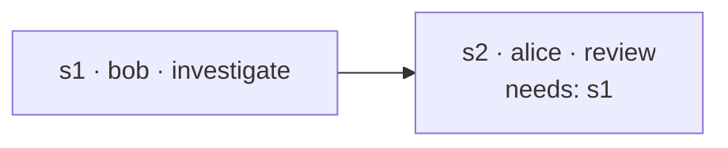

# Tickets

A ticket is how multi-step work between peers is tracked instead of living only in chat
threads that scroll away. It is a **shared record**: one goal, a list of steps, each with
an owner, a dependency list, a status and — once done — a result. Every peer in the room
holds a merged copy, and the TUI shows it in the room's overview.

Tickets are **data, not commands**. Whether and how a step gets done is the owning
person's choice — their agent shows them the step and waits; settling it is their say,
approved in their outbox. A record can't force anyone's machine to do anything.

## A ticket

| Field | Notes |
| --- | --- |
| id | uuid, room-unique |
| project | which shared project it concerns |
| goal | the ask, one line |
| createdBy | peer key — authoritative for the ticket's structure |
| kind | `task` (the plain one) or `review` — see [review tickets](#review-tickets-the-why-travels-with-the-code) |
| steps | see below |

A **step**:

| Field | Notes |
| --- | --- |
| id | `s1`, `s2`, … (or chosen) |
| owner | the peer expected to settle it — a peer, or yourself. Always a person: a step nobody is doing does not exist |
| intent | short verb, like a message's (`investigate`, `review`, …) |
| description | what is being asked, in full |
| needs | step ids that must settle first |
| status | `pending` → `suspended` (delivered to the owner) → `settled` / `failed` |
| result | the owner's findings, or the failure reason |



## How a step gets done

1. A step is **actionable** when its owner hasn't settled it and everything in `needs`
   has settled.
2. Collagen marks it `suspended` (so nothing re-triggers it) and delivers it to the owner
   as a message — on the **same thread a plain message would use** between the ticket's
   creator and that owner about that project. The message carries the step, the
   settled inputs it depends on, and the exact `settle-step` call to make.
3. What happens next follows the [messaging policy](./conversations#what-happens-when-a-message-arrives):
   if the owner's agent has adopted that thread, their conversation resumes with the
   step in it; otherwise it waits in their inbox until they pull it. Nothing is spawned
   for them, and the agent is told to show the step to its person, not to start on it.
4. The owner decides whether and how it gets done — themselves, or by directing their
   agent. When they say it's done (or declined), their agent calls `settle-step` with the
   result they want to send; it waits in their outbox until they approve. The merged
   ticket is then broadcast; steps waiting on this one become actionable on *their*
   owners' side.

Because a ticket has no thread of its own, "the discussion about this work" and "the
status of this work" travel together: the ticket in the overview, its exchange in the
messages tab, both about the same thread.

**Anyone in the room may weigh in**, asked or not: a message sent with the ticket's
`ticketId` (`send-to-peer … ticketId`) belongs to that ticket's conversation whoever sent
it, and shows on the ticket's page for everyone. The people block and the overview row
tell the asker whether the person they asked has answered, and who else has.

**Everyone the ticket concerns hears about it.** The creator, the step owners and anyone
who weighed in are its participants. When a step settles or fails, or someone weighs in,
each participant who isn't the actor or the recipient gets a `ticket-update` in their
inbox — on the thread their own agent knows the ticket by (their own messages about it,
else their step, else the thread with whoever acted) — so an adopted session resumes with
the news exactly like it would with a message. Headline first, as always. An owner whose
own step just became actionable gets the step delivery instead, not an update on top.

### A review gate

There is no separate `review` status. Want the requester to confirm before the work counts
as done? Make the confirmation a step:

```
s1  owner: bob    investigate  "what does average() do"
s2  owner: alice  review       "check bob's answer"   needs: s1
```

Bob's settled result becomes the input to alice's review step, which is delivered to alice
on her thread with bob — the same conversation where she would have asked in the first
place.

## Review tickets: the why travels with the code

A code review normally shows only the output — the *what*. The reviewer sees a diff and
has to guess at intent: why this shape, why not the obvious other one, what was the person
asking for. The half that would answer that is sitting in the author's own conversation
with their agent, and it never leaves their machine.

A **review ticket** carries it. When your user says *"ask Kristian for a review"* — or
just *"put this up for review"* — your agent calls `ask-review` and brings, beside the
branch and the link:

| Field | What it is |
| --- | --- |
| summary | the change in your user's terms |
| branch, base, link | where the code is — read from the project's own `.git` when the agent omits them (a pull request link beats the branch link collagen can derive) |
| decisions | `what` was decided, `userWhy` (how the person steered it — what they asked for, prefaced or ruled out, in their words where the agent has them), `agentWhy` (the agent's own reason), `where` it landed (file, or `file:line`) |
| forks | every point where the work could have gone another way: `at` (`file:line` of the code the choice produced), `chose`, `instead`, `why`, and `by` — the person's call or the agent's |

The agent gathers these by reading back over the conversation it just had. A review with
no decisions, or a decision with no why at all, is **refused** before anything leaves —
half a review is the review a diff already gives you.

Like every ticket it belongs to a **project**: one of the projects your user shares in
this room, which is what gives the review a repo to be about and lets collagen read the
branch and the remote from it. A project they don't share is refused.

### Nought to many reviewers

`peers` is 0 to many, and the ticket follows from it. There is no placeholder step for
"somebody, eventually": a step exists when a person has something on it.

| Asked | The ticket |
| --- | --- |
| one, or several | a `review-<name>` step each, plus your `address` step, which needs all of them so nothing is addressed half-read |
| nobody | just your `address` step — the ticket sits in the room with the why on it |

A review nobody was asked for is pushed to no one: no step delivery, no nudge, nothing in
anyone's inbox. It is there to be read, which is what makes it work on your own — a second
agent of yours reads the room and reviews with the why in hand.

**Reviews are posted, not claimed.** Whoever reads the change calls `post-review`, and it
lands on a step of their own (`review-<them>`): the peer who was asked posts onto the step
they were given, a reader who was not asked gets one, and posting again revises your own.
So a second and a third reader can review the same change without taking anything from
each other, and nothing ever "closes" to the rest of the room. The author's own `address`
step is how the ticket finishes: they settle it when they have what they need.

A step belongs to whoever owns it. Settling someone else's is refused on any ticket — post
your review instead, or say what you think with `send-to-peer` and the ticket's id.

### The ticket keeps up with the code

A review is not a snapshot. The author changes things — before anyone reads it, and again
after the feedback — so the record has to move with them, or people are reviewing a ticket
that no longer exists.

- The why goes on the room's log beside the ticket, so it is there whether or not its
  author is online, and the record's author is its only writer.
- `ask-review` with a `ticketId` **amends** it: add a decision for what changed and why,
  repeat a decision's id to correct one that no longer holds, pass the new `branch` or
  `link` when the code moves.
- Everyone the ticket concerns is **told it was revised** — a `ticket-update` on the
  thread their agent knows the ticket by, saying where the code is now and that what they
  read before may be stale. `review-context` carries an `updated` stamp, and the ticket
  page shows how long ago the why last moved.
- When the author has acted on the feedback they settle their own `address` step, and the
  ticket is done.

On the other side nothing is poured into the reviewer's context. `get-tickets` shows the
headline only (branch → base, the link, how many decisions and forks). When their person
says *"I don't understand why this was made"*, their agent calls `review-context` —
whole, or narrowed with `about` to one file, symbol or phrase — and relays what is there.
Then both sides are reviewing the same thing: the what **and** the why.

::: tip Human in the loop
The why quotes how a person steered their work, so `ask-review` is queued like everything
else: the proposal in the outbox shows the whole text — every `you:` line included —
before it goes anywhere.
:::

## The tools

| Tool | Purpose |
| --- | --- |
| `create-ticket` | goal, project, steps (owner by peer name, intent, description, `needs`) — queued for your approval |
| `settle-step` | settle or fail a step you own, with the result you want to send — queued for your approval |
| `get-tickets` | every ticket in the room you're looking at, merged, with owners resolved to names; a review ticket also shows its headline |
| `ask-review` | ask for a review of the code, with the why: summary, branch/base/link, decisions and forks — one approval for the record and the reasons. `peers` is 0 to many (none = nobody in particular, the ticket sits in the room); `ticketId` amends it as the code moves |
| `post-review` | put your user's review on a review ticket — asked or not; it lands on a step of their own, and posting again revises it |
| `review-context` | read the why behind a review ticket, on demand — all of it, or the part `about` a file, symbol or phrase |

Prefer a ticket over a chain of `send-to-peer` when the work has more than one step or
more than one owner — the intermediate state stays inspectable by everyone, and the
dependency order is enforced by delivery, not by remembering.

## In the TUI

The overview tab lists **every** ticket in the room, whoever made it and whoever it is
for, ordered by what each one wants from you: `needs you` (a step you own is up),
`waiting on bob`, `failed`, `done` — newest activity first within each, finished ones dim
at the end. Nothing is hidden or folded away. Each row: state · goal · who was asked and
whether they answered (`bob✓` spoke or settled, `bob·` silent so far, `carol` weighed in
unasked) · age. The header counts them. `enter` opens the ticket's own
page — the tab bar gives way to a `‹ overview › ticket …` crumb. Its header is the meta:
goal, state, age, project, creator, and the people (`bob✓ carol you·`). Its body: **why**,
on a review ticket — the branch, the counts and the author's summary, with `enter` opening
the whole of it as a page (each decision with `the user:` and `the agent:` lines and the
`file:line` it produced, then the forks with the road not taken);
**steps** with owner, status (`·` pending, `⟳` delivered, `✓` settled, `✗` failed) and
result; **attachments**, when the ticket has any — each file by name, type and size (or
whose conversation it is), who holds it, `○ y fetch` / `⇩ here` ([attachments](./conversations#attachments));
the **conversation** on its threads (every message between the creator and the owners
about this work, plus anything you have waiting to send about it; `enter` for the full
text). At the foot, tucked away, one row of **diagnostics** — `collect transcripts`
([transcripts](./conversations#transcripts-on-request)), which asks the room,
`transcripts`, which opens what came back for reading, and `attach`, which puts a file of
yours on the ticket; `←→` pick, `enter` runs or opens, a result shows beneath. `esc` goes
back to the list.

## Sync model

Tickets live on the room's **log** — an [Autobase](https://github.com/holepunchto/autobase)
every member writes to and every member holds a copy of (see
[Architecture](/internals/architecture#the-room-log-autobase)). Creating or settling
appends the whole ticket record; every member's `apply` folds it into the room's view with
rules that converge regardless of order:

- steps are unioned by id — the creator adds structure, owners never lose steps
- per step, the higher status wins (`settled`/`failed` beat `suspended` beat `pending`);
  equal ranks resolve by timestamp, then a deterministic tiebreak
- the goal follows the newest timestamp

Because it's a replicated log, tickets survive everyone restarting, and a member who was
offline catches up on reconnect — including steps that became theirs while they were away.

### One protocol version at a time

Collagen is an alpha and carries **no compatibility paths**: a record written by a build
that spoke an older `PROTOCOL_VERSION` is not translated, tolerated or half-shown. It is
migrated out.

- Reading the view drops any row this build cannot decode, so nothing malformed reaches
  the app — a stale ticket can never break the room's page.
- The rows it dropped are then **evicted**: one `evict` entry on the log names them, every
  member applies the same deletion, and the room converges clean. The log itself is
  append-only, so this is the equivalent of a migration — the dead record stops being part
  of the room instead of being maintained.
- A record from another version that overwrites a row you have also ejects that row, so
  you never keep a half-applied ticket.
- A peer whose frames don't decode is not silently absent: their greet still says which
  version wrote it, and the log tells you which side has to update.
- Locally, the state file is salvaged rather than discarded: a queued proposal from an
  older build is dropped and named, and your rooms, projects and adopted sessions stay.

## What changed from the original plan

The first spec was a mini-Jira: columns `todo / doing / review / done / blocked /
wont-do`, an assignee, a status history. It was replaced by the step model above before
any of it shipped: agents need dependencies and results more than columns, several peers
can own parts of one ticket, and a review gate is just a step. Human-facing board views
can still be derived from the steps if they turn out to be wanted.
