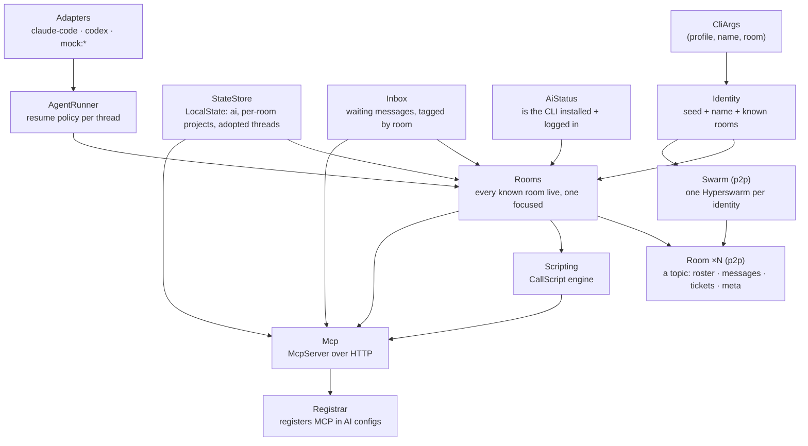

# Architecture

Collagen is a pnpm + Turborepo monorepo. Two workspaces matter:

- **`packages/p2p`** — the peer-to-peer core: wire schema, the `Room` service, ticket
  merge rules, identity and topic helpers. No UI, no process spawning.
- **`apps/cli`** — the CLI: Effect services that wrap the OS (files, child processes,
  HTTP), the MCP server, the agent runner, and the OpenTUI + React TUI.

Everything runs on [Effect](https://effect.website) v4: services are `Context.Service`
classes, wired together as layers, with typed errors and scoped resource lifecycles.

## Service layer graph

All of these are merged into a single **`AppLayer`** (`apps/cli/src/services/AppLayer.ts`),
which requires only `CliArgs`. Both entrypoints provide it:

- **`index.tsx`** — the TUI (`effect/unstable/cli` + `NodeRuntime.runMain`; needs
  `--experimental-ffi` for OpenTUI).
- **`headless.ts`** — the same app without a terminal, for dev and headless hosts.

## `Rooms`: many rooms, one focused

`Rooms` (`apps/cli/src/services/Rooms.ts`) opens a `Room` for every room in the profile,
each in its own `Scope`, and runs the per-room daemons inside it: incoming message →
inbox + agent run, actionable ticket step → delivery, drive requests (mock peers only),
shared room name → persisted. The **focused** room is a `SubscriptionRef`; the profile
each room broadcasts derives `away` from it. Tools resolve the focused room per call, and
UI atoms follow it with `watch` (a `switchMap` over focus), so switching is instant and
nothing restarts. `join` opens a room live; `summaryChanges` streams one line per room
(name, online, unread, focused) for the rail and `list-rooms`.

## The p2p core: `Swarm` and `Room`

`Swarm` (`packages/p2p/src/Swarm.ts`) is **one Hyperswarm per identity** — one DHT node
per keypair, however many rooms. A room is a **topic** on it; a peer you share several
rooms with is **one connection** carrying frames for each. (The first design ran one
swarm per room; two DHT nodes announcing the same key made relayed handshakes land on
the wrong node and connections time out for minutes — found 2026-09-07.)

- `acquireRelease` creates the swarm and destroys it when the scope closes.
- What crosses a connection is an **envelope**: `{ topic, frame }`. Five frame kinds:
  `profile` (presence), `msg` (directed message), `ticket` (a whole ticket, merged on
  receipt), `room-meta` (the shared name, last-writer-wins), `drive` (remote control of a
  mock peer). The swarm routes each envelope to the room registered for its topic.
- A room joins with `TopicHooks` — `greet(key)`, `onFrame(key, frame)`, `onPeerGone(key)`.
  When a connected peer is discovered on a topic we're in, the swarm asks that room to
  greet (idempotent; re-swept every 15 s and on hyperswarm `update`, because topics can
  arrive after the connection). Nothing is ever said to a peer about rooms it wasn't
  discovered in — an invite is a secret.
- Discovery is refreshed every 15 s per topic; a health line is logged every minute, and
  if peers are known but none are connected for two minutes the swarm is recreated (a
  hyperswarm connection attempt can hang and block rediscovery).

`Room` (`packages/p2p/src/Room.ts`) is a **scoped service** for one topic on the swarm:

- Roster (peers who greeted us *in this room*), tickets and meta are `SubscriptionRef`s
  (current value + `.changes` stream); inbound messages are a `PubSub` exposed as a
  `Stream`.
- Greeting a peer sends our profile, the room name, and every ticket we know — that's
  how a late joiner reconstructs shared state. A peer that greets us first is answered in
  kind.
- `sendTo` requires the peer to be *in the room*, not merely connected through another.

Every envelope is validated with `Schema` at the boundary (`EnvelopeFromJson`);
malformed ones are logged and dropped, never trusted. Unknown fields are ignored, so
peers on slightly different versions keep talking.

### Threads

A message's `threadId` is `sha256(sortedPeerKeys | project)` — **symmetric**, so A→B and
B→A hash to the same thread. Ticket steps use the same derivation between the ticket's
creator and the step's owner (`stepThreadId`), so a ticket has no thread of its own.

### Tickets

`packages/p2p/src/ticket.ts` holds the merge rules: steps unioned by id, per-step higher
status wins, then timestamp, then a deterministic tiebreak — a join semilattice per
field, so every peer converges whatever the arrival order. `actionableSteps` decides what
a given peer should act on now.

## The MCP server

`Mcp` (`apps/cli/src/services/Mcp.ts`) builds an `effect/unstable/ai` `McpServer` served
over Streamable HTTP on a deterministic per-profile port (`portForProfile`, 41000–44999,
ephemeral fallback logged with its reason). Tools are `Schema`-typed and grouped: room,
messages, tickets, settings, scripting — see [Using the CLI](/guide/using-the-cli#your-agents-side).
Dev runs (`COLLAGEN_DEV=1`) add `drive-peer`; a production build never registers it.

Two plain HTTP routes exist for harnesses without a convenient blocking tool call:
`GET /inbox/pending` and `GET /inbox/wait?seconds=N` (long-poll, 204 on timeout).

Interop shims for strict MCP clients (Codex's `rmcp`) live here — see
[Effect patterns](./effect-patterns#mcp-interop-shims).

## `AgentRunner`: the resume policy

When a message (or a ticket step) lands, `Rooms` calls `AgentRunner.runThread`. It never
cold-starts a real AI. Per thread:

| Situation | What happens |
| --- | --- |
| no preferred AI | message stays in the inbox |
| real AI, thread not adopted | stays in the inbox (`pending-threads` / `await-messages`) |
| adopted `claude-code` session | `claude -p --resume <session>` — appends to the user's open session |
| adopted `codex` thread | `codex queue --thread <id> --message …` — delivered on its next turn |
| `mock:*` | spawns the mock agent (test dummy; acks up to 3× per thread) |

Adapters (`Adapters.ts`) encode each CLI's flags and how to parse a session id from its
output; both the adapter and the process spawner are injectable, which is how the tests
run without any real CLI. Runs are **serialized per thread** with a semaphore, and a run
re-checks the inbox before releasing so nothing is dropped.

## The TUI

OpenTUI + React on `@effect/atom-react`; the runtime is one atom every other atom derives
from. Code layout (routes / layouts / components / atoms-at-the-lowest-shared-folder) and
the `Focusable` navigation primitive are described in
[Local development](./development#ui-code-layout-appsclisrc).
