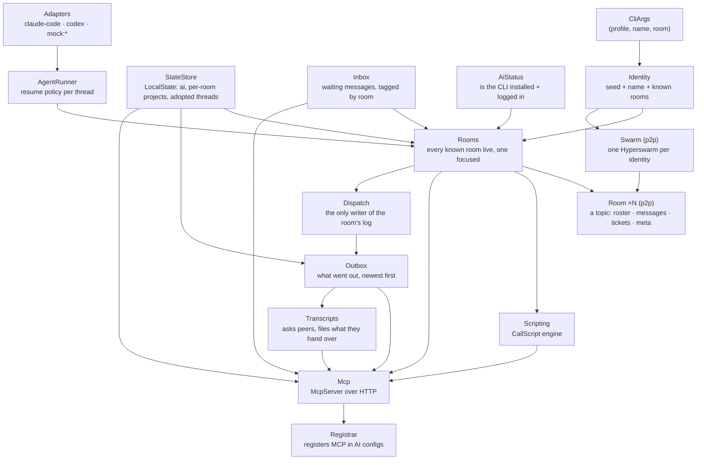

# Architecture

Collagen is a pnpm + Turborepo monorepo. Two workspaces matter:

- **`packages/p2p`** — the peer-to-peer core: wire schema, the `Room` service, ticket
  merge rules, identity and topic helpers. No UI, no process spawning.
- **`apps/cli`** — the CLI: Effect services that wrap the OS (files, child processes,
  HTTP), the MCP server, the agent runner, and the OpenTUI + React TUI.

Everything runs on [Effect](https://effect.website) v4: services are `Context.Service`
classes, wired together as layers, with typed errors and scoped resource lifecycles.

## Service layer graph

All of these are merged into a single **`AppLayer`** (`apps/cli/src/services/AppLayer.ts`),
which requires only `CliArgs`. Both entrypoints provide it:

- **`index.tsx`** — the TUI (`effect/unstable/cli` + `NodeRuntime.runMain`; needs
  `--experimental-ffi` for OpenTUI).
- **`headless.ts`** — the same app without a terminal, for dev and headless hosts.

## `Rooms`: many rooms, one focused

`Rooms` (`apps/cli/src/services/Rooms.ts`) opens a `Room` for every room in the profile,
each in its own `Scope`, and runs the per-room daemons inside it: incoming message →
inbox + agent run, actionable ticket step → delivery, drive requests (mock peers only),
shared room name → persisted. The **focused** room is a `SubscriptionRef`; the profile
each room broadcasts derives `away` from it. Tools resolve the focused room per call, and
UI atoms follow it with `watch` (a `switchMap` over focus), so switching is instant and
nothing restarts. `join` opens a room live; `summaryChanges` streams one line per room
(name, online, unread, focused) for the rail and `list-rooms`.

## The p2p core: `Swarm` and `Room`

`Swarm` (`packages/p2p/src/Swarm.ts`) is **one Hyperswarm per identity** — one DHT node
per keypair, however many rooms. A room is a **topic** on it; a peer you share several
rooms with is **one connection** carrying frames for each. (The first design ran one
swarm per room; two DHT nodes announcing the same key made relayed handshakes land on
the wrong node and connections time out for minutes — found 2026-09-07.)

- `acquireRelease` creates the swarm and destroys it when the scope closes.
- What crosses a connection is an **envelope**: `{ topic, frame }`. Five frame kinds:
  `profile` (presence), `msg` (directed message), `ticket` (a whole ticket, merged on
  receipt), `room-meta` (the shared name, last-writer-wins), `drive` (remote control of a
  mock peer). The swarm routes each envelope to the room registered for its topic.
- A room joins with `TopicHooks` — `greet(key)`, `onFrame(key, frame)`, `onPeerGone(key)`.
  When a connected peer is discovered on a topic we're in, the swarm asks that room to
  greet (idempotent; re-swept every 15 s and on hyperswarm `update`, because topics can
  arrive after the connection). Nothing is ever said to a peer about rooms it wasn't
  discovered in — an invite is a secret.
- Discovery is refreshed every 15 s per topic; a health line is logged every minute, and
  if peers are known but none are connected for two minutes the swarm is recreated (a
  hyperswarm connection attempt can hang and block rediscovery).

`Room` (`packages/p2p/src/Room.ts`) is a **scoped service** for one topic on the swarm
plus that room's log:

- Roster = peers who greeted us *in this room* (presence, ephemeral). Tickets, members,
  the name and the message trace are read from the log's view into `SubscriptionRef`s
  whenever the log changes.
- Greeting a peer sends our profile and, if we know it, the log's key (`log-info`); a
  joiner answers with `join-log` and a member appends `add-writer`.
- `messages` (the ones addressed to us) is a stream that **replays** what the log already
  holds on subscribe and then follows — a PubSub here would drop entries that arrived
  before anyone listened, which is exactly the offline-catch-up case.
- `sendTo` / `shareTicket` / `rename` append to the log; they fail typed (`NotWritable`)
  until we're admitted. `sendDrive` stays ephemeral and needs the peer present.

Every envelope is validated with `Schema` at the boundary (`EnvelopeFromJson`);
malformed ones are logged and dropped, never trusted. Unknown fields are ignored, so
peers on slightly different versions keep talking.

## The room log (Autobase)

`RoomLog` (`packages/p2p/src/RoomLog.ts`) wraps one
[Autobase](https://github.com/holepunchto/autobase) per room, in a namespace of the
identity's Corestore (`~/.config/collagen/store-<profile>`), with a
[Hyperbee](https://github.com/holepunchto/hyperbee) view (`json` values, no extension).

- **Writers**: every member. The room's creator bootstraps the base (its key is the
  `logKey` persisted in the profile and sent in greets); a joiner opens it by key and is
  admitted when a member appends `add-writer` with the joiner's local core key. Members
  are indexers too — fine at room scale.
- **Entries** (`LogOp`, Schema-validated in `apply`; bad entries skipped): `add-writer`,
  `member` (key + name, so offline peers still resolve), `ticket` (full record, merged with
  `mergeTicket`), `rename` (LWW by ts), `msg` (a `RoomMessage` with `to`), `attachment`
  (a reference, first write wins), `review` (the why behind a review ticket, LWW by ts —
  its author is its only writer).
- **View keys**: `ticket/<id>`, `member/<key>`, `meta/name`, `msg/<000…seq>` +
  `state/msgs` (the counter). `apply` reads and writes only the view — Autobase may
  reorder entries when causal forks arrive, and re-applies deterministically.
- **Replication** is Corestore's, over every swarm connection (`store.replicate(conn)`),
  multiplexed with our envelope channel by Protomux. A member who was offline gets every
  missing block from whoever is around, then `apply` catches up their view.
- **Unread** is local: `Inbox` keeps, per room and thread, the log position of the last
  message pulled (`LocalState.consumed`), so a restart re-reads the log and lands on the
  same waiting set.

### Threads

A message's `threadId` is `sha256(sortedPeerKeys | project)` — **symmetric**, so A→B and
B→A hash to the same thread. Ticket steps use the same derivation between the ticket's
creator and the step's owner (`stepThreadId`), so a ticket has no thread of its own.

### Tickets

`packages/p2p/src/ticket.ts` holds the merge rules: steps unioned by id, per-step higher
status wins, then timestamp, then a deterministic tiebreak — a join semilattice per
field, so every peer converges whatever the arrival order. `actionableSteps` decides what
a given peer should act on now.

## The MCP server

`Mcp` (`apps/cli/src/services/Mcp.ts`) builds an `effect/unstable/ai` `McpServer` served
over Streamable HTTP on a deterministic per-profile port (`portForProfile`, 41000–44999,
ephemeral fallback logged with its reason). Tools are `Schema`-typed and grouped: room,
messages, tickets, settings, scripting — see [Using the CLI](/guide/using-the-cli#your-agents-side).
Dev runs (`COLLAGEN_DEV=1`) add `drive-peer`; a production build never registers it.

Two plain HTTP routes exist for harnesses without a convenient blocking tool call:
`GET /inbox/pending` and `GET /inbox/wait?seconds=N` (long-poll, 204 on timeout).

### `Outbox`: one door out, and a receipt

Every tool that writes to a room's log on the agent's behalf — `send-to-peer`,
`create-ticket`, `ask-review`, `post-review`, `settle-step`, `attach-files` — goes through
one door. Each validates its input (unknown peer or step fails at once) and hands
`Outbox.send` a `Proposal`: room, recipient, title, and an `Outgoing` — plain data
(`packages/p2p/src/schema.ts`): a message by peer *name*, a full ticket record, a review
with its why, a step settlement, files, a transcript.

`Outbox.send(p)` hands it to **`Dispatch`** — the only place the cli appends anything to a
room's log for the agent: it looks up the room, resolves the peer by name, applies a
settlement to the ticket as it currently is, writes, and returns a `Done`: `sent(text)` or
`refused(text)`. That is a type and not a string starting with "failed:", because the
outbox has to know — a record goes into `LocalState.sent` (newest first, capped) **only**
for a `sent`, so the tab is what left this machine rather than what was attempted. A
caller that must react to a refusal reads the tag (`Transcripts.share` keeps a peer's
request alive when the transcript did not get there); one that only relays uses
`Outbox.tell`, which is `send` with the text taken out.

There is no approval queue, and there used to be: the agent proposed, the person pressed
`y`. It was theatre — an agent acts only on its person's request, so the person was
approving what they had just asked for — and "exists but is not quite sent" was a state
nobody could reason about (removed 2026-09-10 on the user's call). Human in the loop is
about who decides: the tools say "only when your user asks", incoming messages are relayed
and never answered on the agent's initiative, a step settles because the person said it
was done, and the outbox is the receipt.

### Ticket updates for participants

`Rooms`' per-room daemons also watch the room's tickets and trace for news that concerns
this machine's person without being addressed to them: a step settling or failing, or a
message tagged with a ticket they are part of. `lib/ticketUpdates.ts` decides who is a
participant (creator, owners, anyone who wrote about it) and which thread their agent
knows the ticket by; the daemon pushes a local `ticket-update:*` inbox message on that
thread and runs the thread — the same path a delivered step takes. Local, not on the log:
the log already holds the facts.

### Diagnostics: a registry, two surfaces

`apps/cli/src/diagnostics/` holds one file per diagnostic — `id`, `title`, `summary` (the
tool description), `params` (the agent's schema), `fromContext` (params from where the
person is in the TUI, or null), `run(params, ctx, deps)` returning the text both surfaces
show — and `index.ts` lists them. `Mcp.ts` builds a `Tool` per entry (prefixed
"DIAGNOSTIC, only when the user asks for it") and merges that toolkit with the room's;
the ticket page lists the entries whose `fromContext` applies and runs them with the same
deps. Adding a diagnostic touches that folder only.

### `Transcripts`: the one ask that waits

`Transcripts` (`apps/cli/src/services/Transcripts.ts`) sits above `Outbox`. `request(room,
subject, threadIds)` files the requester's own adopted slices, then broadcasts a
`transcript-request` frame (ephemeral, direct). On every other machine the service
*keeps* the request — one `TranscriptAsk` in local state per adopted thread it has a
session file for (`since` = the adoption time stored on `AdoptedThread`) — and answers
nothing: everything else an agent sends is something its person asked for, and this is
the one thing they did not, so it waits for their word. `share-transcripts` (a
diagnostic, `transcripts.share`) turns the waiting asks into `Outgoing.kind =
"transcript"` sends and drops them; `decline: true` drops them and tells the peer
nothing; `list-transcripts` shows what is waiting so the agent can read the asks out. A
send reaches `Dispatch`, which reads the session file *now*, keeps the lines from
`since` on (`lib/transcripts.ts`: `sessionFile`, `sliceSince`), gzips them and sends a
`transcript` frame to the requester alone. The requester's `Transcripts` files it under
`~/.config/collagen/transcripts/<subject>/`. Nothing touches the room log; no agent CLI
runs — the files are read where the CLIs keep them (`CLAUDE_CONFIG_DIR`, `CODEX_HOME`
honoured).

The receiving half of the same principle is not enforceable in code: an agent's own
reasoning can't be gated. It is carried by the nudge (`Adapters.nudgePrompt`), the ticket
step message (`Rooms`), and every tool description that touches messages — all of which
say: here is the headline, tell your user, wait; read the thread from collagen when they
ask and never invent; a question the thread can't answer is theirs (this repo, under
direction) or the peer's (draft it, into the outbox). `RelayAgent.test.ts` pins these
strings and runs the tools under a scripted `LanguageModel` that follows them.

Interop shims for strict MCP clients (Codex's `rmcp`) live here — see
[Effect patterns](./effect-patterns#mcp-interop-shims).

### `Attachments`: files by reference

`Attachments` (`apps/cli/src/services/Attachments.ts`) puts files on tickets without
moving them. `attach(room, ticket, goal, paths, note?)` describes each path
(`lib/attachments.ts`: name, size, MIME by extension; a `.meta.json` beside it makes it a
transcript and carries that meta) and sends `Outgoing.kind = "attach"`.
`Dispatch` appends one `LogOp { op: "attachment" }` per file — the `Attachment` record:
id, ticket, holder key and name, name/bytes/mime, note, optional `transcript` info,
`attachedAt`; no path — and remembers `attachment id → local path` in
`LocalState.attachedFiles`. `RoomLog` keeps them under `attachment/<ticketId>/<id>`
(first write wins) and `LogView.attachments` lists them; `Room.attachments` is the
SubscriptionRef. Fetching is ephemeral and direct: `Room.fetchAttachment(holder, id)`
sends a `fetch-attachment` frame; the holder's `Attachments` answers only for ids in its
`attachedFiles` (gzipped bytes in an `attachment` frame, 8 MB cap), and the fetcher files
them under `~/.config/collagen/attachments/ticket-<id8>/<id8>-<name>` + `.meta.json`, or,
for a transcript, through `Transcripts.fileIncoming` next to the other transcripts with
`origin`/`via` in its meta. `held` merges the three sources (attached by us, fetched,
fetched transcripts) into `id → path` for the ticket page and `fetch-attachments`.

### One protocol version at a time (and how records leave)

`PROTOCOL_VERSION` (`packages/p2p/src/schema.ts`) is the whole compatibility story: an
alpha keeps no path for an older build's shapes, and every wire and log field is required.
What that needs, so nothing can brick:

- **`RoomLog.read` never trusts the view.** Every row is decoded against its schema
  (`Ticket`, `Member`, `RoomMessage`, `Attachment`, `ReviewContext`); rows that fail are
  kept out of `LogView` and remembered as stale.
- **`RoomLog.evictStale` is the migration.** It appends one `LogOp { op: "evict", keys }`,
  applied by every member (`EVICTABLE` limits it to room records — never `meta/`), so the
  cleanup replicates instead of each side hiding its own mess. `Room.refresh` calls it, so
  it runs as soon as we are admitted; it is idempotent and its own log entry ends the loop.
- **`apply` ejects on overwrite**: an entry it cannot decode deletes the view row it
  claims (`claimedKey`), so a record from another version leaves nothing half-applied.
- **`Swarm.protocolOf`** reads only `frame.profile.protocol` out of a frame that failed to
  decode — deliberately schema-free — so a peer on another version is told to update
  rather than appearing to be offline.
- **`lib/localState.ts` salvages the state file** instead of falling back to empty: parts
  that still decode are kept, the rest are dropped, named in the log and written back.
  A stale outbox record must not cost the user their rooms.

### Review tickets: the why as data

`ask-review` (`services/Mcp.ts`) builds two things from one call: a `Ticket` with
`kind: "review"` (a `review-<name>` step per person asked — none when nobody was asked —
plus an `address` step the author owns that needs them all) and a `ReviewContext`
(`packages/p2p/src/review.ts`) — summary, branch/base/link, `decisions` (`what`,
`userWhy`, `agentWhy`, `where[]`) and `forks` (`at`, `chose`, `instead`, `why`, `by`).
Branch and link fall back to the shared project's own `.git` (`lib/gitInfo.ts`: HEAD, a
worktree's `gitdir:` pointer, `origin` as an https URL). `lib/review.ts` refuses an empty
why (`reviewGaps`) and renders it back (`reviewRows`, `reviewHeadline`). Both travel as
one `Outgoing.kind = "review"`, so the record and the reasons land together, and the
outbox keeps the whole text — every quoted line — as the receipt. `Dispatch` appends the ticket, then
`LogOp { op: "review" }`; `RoomLog` keeps it at `review/<ticketId>` (later `ts` wins) and
`Room.reviews` is the SubscriptionRef. An amendment is the same call with `ticketId`:
`mergeReview` folds the delta into what the log has, only the author may write it, and
`reviewChanges` diffs by ts so every participant gets a `ticket-update`. Reading is on
demand — the `review-context` diagnostic, optionally narrowed by `about`.

Two pure rules in p2p own who may change what, and both `Dispatch` and `Rooms`' drive
handler use them (separate copies of this once let the test tool prove behaviour
production did not have):

- `settleStep` — a step belongs to its owner. Anyone else gets `not-yours` and nothing
  changes. There is no sentinel owner: a step nobody is doing does not exist.
- `postReview` — a reader's review, upserted onto `review-<their name>`
  (`reviewStepId`, keyed apart by pubkey when two people share a display name). Asked or
  not, everyone's review is their own step, so reviews accumulate instead of being
  claimed. It reaches the log through `Outgoing.kind = "post-review"`, so it lands in the
  outbox like everything else that went out.

## `AgentRunner`: the resume policy

When a message (or a ticket step) lands, `Rooms` calls `AgentRunner.runThread`. It never
cold-starts a real AI. Per thread:

| Situation | What happens |
| --- | --- |
| no preferred AI | message stays in the inbox |
| real AI, thread not adopted | stays in the inbox (`pending-threads` / `await-messages`) |
| adopted `claude-code` session | `claude -p --resume <session>` — appends to the user's open session |
| adopted `codex` thread | `codex queue --thread <id> --message …` — delivered on its next turn |
| `mock:*` | spawns the mock agent (test dummy; acks up to 3× per thread) |

Adapters (`Adapters.ts`) encode each CLI's flags and how to parse a session id from its
output; both the adapter and the process spawner are injectable, which is how the tests
run without any real CLI. Runs are **serialized per thread** with a semaphore, and a run
re-checks the inbox before releasing so nothing is dropped.

## The TUI

OpenTUI + React on `@effect/atom-react`; the runtime is one atom every other atom derives
from. Code layout (routes / layouts / components / atoms-at-the-lowest-shared-folder) and
the `Focusable` navigation primitive are described in
[Local development](./development#ui-code-layout-appsclisrc).
