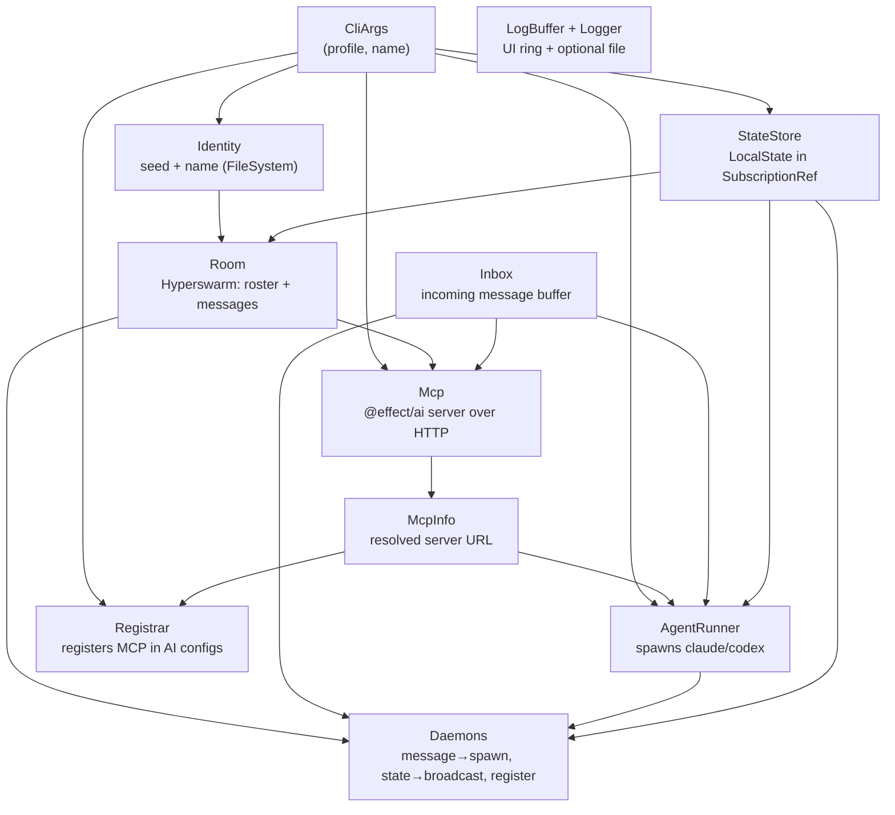
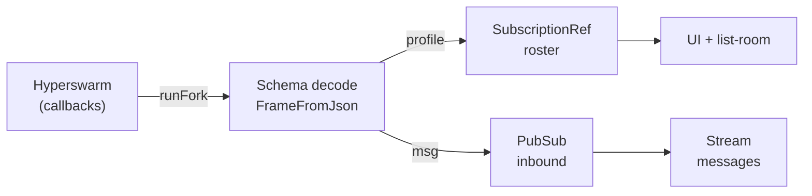

# Architecture

Collagen is a pnpm + Turborepo monorepo. Two workspaces matter:

- **`packages/p2p`** — the peer-to-peer core: wire schema, the `Room` service, identity
  and topic helpers. No UI, no process spawning.
- **`apps/cli`** — the CLI: Effect services that wrap the OS (files, child processes, HTTP),
  the MCP server, the agent spawner, and the OpenTUI-based TUI.

Everything runs on [Effect](https://effect.website): services are `Effect.Service`
classes, wired together as layers, with typed errors and scoped resource lifecycles.

## Service layer graph

All of these are merged into a single **`AppLayer`** (`apps/cli/src/services/AppLayer.ts`),
which requires only `CliArgs`. Both entrypoints provide `CliArgs` and launch it:

- **`index.tsx`** — the OpenTUI TUI (via `@effect/cli` + `NodeRuntime.runMain`; needs `--experimental-ffi`).
- **`headless.ts`** — the same app without a terminal, for dev and headless hosts.

## The p2p core: `Room`

`Room` (`packages/p2p/src/Room.ts`) is a **scoped service** wrapping a Hyperswarm swarm:

- `acquireRelease` creates the swarm and destroys it when the scope closes.
- Peers are exchanged as `profile` frames; directed messages as `msg` frames — both over
  the **same connections**.
- The current roster is a `SubscriptionRef<ReadonlyArray<Peer>>` (current value + a
  `.changes` stream). Inbound messages are a `PubSub<RoomMessage>` exposed as a `Stream`.
- Callbacks from the library (`swarm.on("connection")`, `conn.on("data")`) are bridged
  into Effect with a captured `Runtime.runFork`.

Every frame is validated with `Schema` at the boundary (`FrameFromJson`); malformed
frames are logged and dropped, never trusted.

### Threads

A message's `threadId` is `sha256(sortedPeerKeys | project)` — **symmetric**, so A→B and
B→A hash to the same thread. That's what lets a reply continue the same AI session on the
other side instead of starting a fresh one.

## The MCP server

`Mcp` (`apps/cli/src/services/Mcp.ts`) builds an [`@effect/ai`](https://effect.website/docs/ai/introduction/)
`McpServer` served over Streamable HTTP on a deterministic per-profile port
(`portForProfile`, 41000–44999, with an ephemeral fallback). Three tools, all
`Schema`-typed:

| Tool | Purpose |
| --- | --- |
| `list-room` | Peers in the room and the projects each shares. |
| `send-to-peer` | Send a finding/request to a peer about a project. |
| `get-messages` | Drain messages sent to you (optionally one thread). |

Two interop shims live here because strict MCP clients (Codex's `rmcp`) are picky about
transport framing — see [Effect patterns](./effect-patterns#mcp-interop-shims).

## Spawning the other agent

When a message arrives, `AgentRunner` (`apps/cli/src/services/AgentRunner.ts`) runs the
recipient's preferred AI headless in the target project's directory, via
`@effect/platform` `Command`. Adapters encode each AI's CLI flags and how to parse its
output for a resumable session id. Runs are **serialized per thread** with a semaphore —
concurrent resumes of one session would corrupt the transcript.
