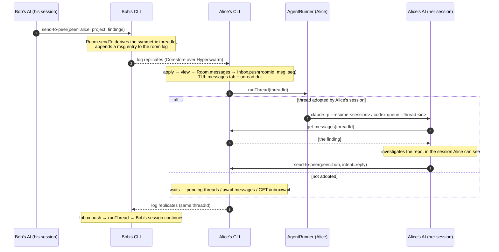
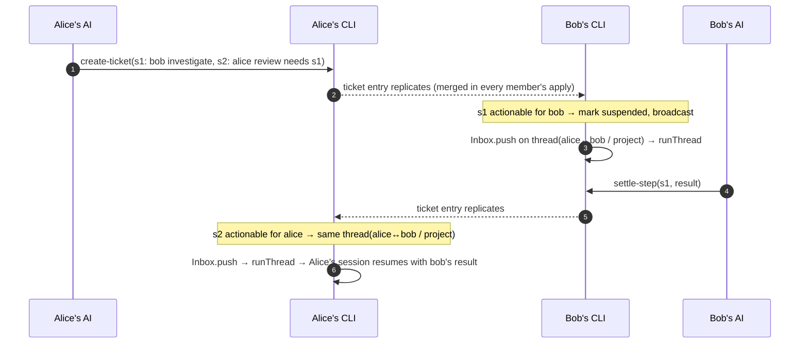
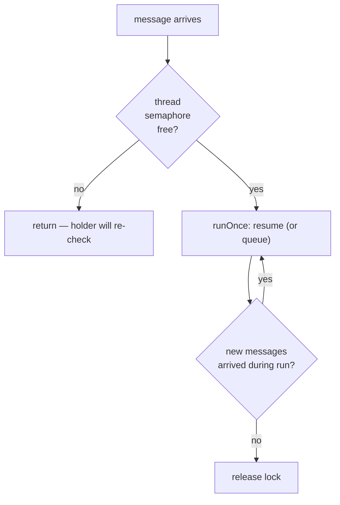

# Message flow

A full round trip: Bob's agent sends a finding, Alice's agent picks it up in her own
session, acts, and replies — all on one thread.

## Sequence



## Why the thread is symmetric

`send-to-peer` doesn't carry a thread id — Collagen derives one:

```
threadId = sha256( sort(myKey, peerKey).join("|") + "|" + project ).slice(0, 16)
```

Because the two keys are **sorted** before hashing, Bob→Alice and Alice→Bob about the
same project produce the **same** `threadId`. `adopt-thread` stores `threadId →
{agent, sessionId}` in the local state; a message on an adopted thread **resumes** that
session rather than starting anything, so the conversation has continuity for both agents.
An agent can never choose or change a thread id.

## Ticket steps take the same road



The step's thread is the one between the ticket's creator and the step's owner about the
project (`stepThreadId`); the creator's own steps continue the thread with the peer whose
work they wait on. So the ticket's discussion and its status are one conversation.

## Per-thread serialization

Two deliveries on the same thread must not resume one session twice at once — concurrent
resumes corrupt its transcript. `AgentRunner.runThread`:



A call that finds the lock taken returns immediately; the fiber holding it re-checks the
inbox after each run and loops if anything new arrived. No message is dropped, and no
thread runs twice at once.

## Delivery guarantees

- **Store-and-forward.** A message is an entry on the room's log, so `send-to-peer` to a
  member who is offline succeeds; they read it from whoever has the log when they are next
  online. Only a peer never admitted to the log is unreachable (`NotWritable` on your side
  says *you* aren't admitted yet).
- **Exactly-once into the inbox.** Each message has a log position; the inbox drops
  positions at or below the thread's pulled cursor and duplicates by id.
- **No read receipts.** The sender can't tell whether the recipient has pulled a message —
  see [Status](/status).
- **Tickets converge.** Every ticket change is a full-record entry merged in `apply` with
  deterministic rules; the log's order is the same for every member.
